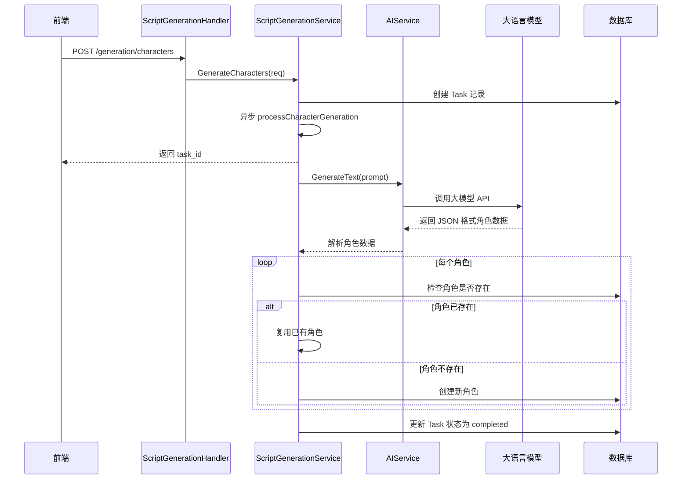

# Huobao Drama - 火宝短剧业务逻辑与技术架构文档

> **项目版本**: v1.0.0
> **文档日期**: 2026-01-31
> **文档类型**: 业务逻辑与架构分析

---

## 目录

- [一、项目概述](#一项目概述)
- [二、核心业务流程](#二核心业务流程)
- [三、领域模型分析](#三领域模型分析)
- [四、代码结构分析](#四代码结构分析)
- [五、关键代码路径解析](#五关键代码路径解析)
- [六、技术栈总结](#六技术栈总结)
- [七、业务规则说明](#七业务规则说明)
- [八、数据库表结构](#八数据库表结构)
- [九、关联关系设计](#九关联关系设计)
- [十、文件位置快速索引](#十文件位置快速索引)
- [附录](#附录)

---

## 一、项目概述

### 1.1 项目简介

**火宝短剧 (Huobao Drama)** 是一个基于 Go + Vue3 的全栈 AI 短剧自动化制作平台，实现了从剧本生成、角色设计、分镜制作到视频合成的完整工作流程。

### 1.2 核心特点

| 特点 | 说明 |
|-----|------|
| **🤖 AI 驱动** | 使用大语言模型解析剧本，提取角色、场景和分镜信息 |
| **🎨 智能创作** | AI 绘图生成角色形象和场景背景 |
| **📹 视频生成** | 基于文生视频和图生视频模型自动生成分镜视频 |
| **🔄 完整工作流** | 从创意到成片一站式完成 |
| **🏗️ DDD 架构** | 清晰的领域驱动设计分层 |
| **⚡ 异步任务** | 长时间运行的任务使用 goroutine 异步处理 |
| **💾 本地存储** | 实现本地文件存储策略，避免外部资源链接失效 |

### 1.3 技术栈概览

```
┌─────────────────────────────────────────────────────────────┐
│                        前端技术栈                            │
├─────────────────────────────────────────────────────────────┤
│  Vue 3.4+ │ TypeScript 5+ │ Vite 5 │ Element Plus │ Pinia  │
│  TailwindCSS │ Vue Router │ Axios │ FFmpeg.wasm              │
└─────────────────────────────────────────────────────────────┘

┌─────────────────────────────────────────────────────────────┐
│                        后端技术栈                            │
├─────────────────────────────────────────────────────────────┤
│  Go 1.23+ │ Gin Web Framework │ GORM ORM │ SQLite          │
│  Zap 日志 │ FFmpeg │ OpenAI API │ Gemini API │ 豆包 API    │
└─────────────────────────────────────────────────────────────┘
```

---

## 二、核心业务流程

### 2.1 整体业务流程图

```
┌─────────────────────────────────────────────────────────────────┐
│                         短剧制作完整流程                          │
└─────────────────────────────────────────────────────────────────┘

1. 创建剧本 (Drama)
   ├── 设置剧本标题、描述、类型
   ├── 保存剧本大纲
   └── 设置总章节数

2. 生成角色 (Characters)
   ├── AI 根据大纲生成角色列表
   ├── 角色包含：姓名、角色、描述、性格、外貌、声音风格
   └── 角色图片生成（可选）

3. 创建章节 (Episodes)
   ├── 为每个章节生成剧本内容
   ├── 设置章节标题、描述、时长
   └── 关联章节角色

4. 生成分镜 (Storyboards)
   ├── AI 根据章节剧本生成分镜脚本
   ├── 每个分镜包含：标题、景别、角度、运镜、动作、对话、氛围
   ├── 自动提取场景 (Scenes)
   ├── 自动提取道具 (Props)
   └── 生成分镜参考图

5. 生成场景图 (Scene Images)
   ├── 为每个场景生成背景图
   └── 保存到本地存储

6. 生成角色图 (Character Images)
   ├── 为每个角色生成形象图
   └── 支持参考图模式

7. 生成分镜视频 (Storyboard Videos)
   ├── 基于分镜图生成视频片段
   ├── 支持多种参考模式（单图/首尾帧/多图）
   └── 异步轮询任务状态

8. 视频合成 (Video Merge)
   ├── 选择多个视频片段
   ├── 按顺序排列
   ├── 添加转场效果
   └── 输出最终视频

9. 音频处理（可选）
   ├── 音频提取
   ├── BGM 生成
   └── 音视频合成
```

### 2.2 剧本生成流程

```
┌─────────────────────────────────────────────────────────────┐
│                      剧本生成详细流程                          │
└─────────────────────────────────────────────────────────────┘

用户请求: POST /api/v1/dramas
    ↓
┌─────────────────────────────────────────────────────────────┐
│  DramaHandler.CreateDrama()                                  │
│  文件位置: api/handlers/drama.go:31                          │
└─────────────────────────────────────────────────────────────┘
    ↓
┌─────────────────────────────────────────────────────────────┐
│  DramaService.CreateDrama()                                  │
│  文件位置: application/services/drama_service.go:53          │
└─────────────────────────────────────────────────────────────┘
    ↓
┌─────────────────────────────────────────────────────────────┐
│  验证请求参数                                                 │
│  创建 Drama 实体                                              │
│  保存到数据库: gorm.DB.Create(&drama)                       │
└─────────────────────────────────────────────────────────────┘
    ↓
返回: JSON { drama_id, title, status, ... }

───────────────────────────────────────────────────────────────

用户请求: PUT /api/v1/dramas/:id/outline
    ↓
┌─────────────────────────────────────────────────────────────┐
│  DramaService.SaveOutline()                                  │
│  更新剧本的大纲描述                                           │
└─────────────────────────────────────────────────────────────┘
    ↓
返回: JSON { success: true }

───────────────────────────────────────────────────────────────

用户请求: POST /api/v1/generation/characters
    ↓
┌─────────────────────────────────────────────────────────────┐
│  ScriptGenerationService.GenerateCharacters()               │
│  文件位置: application/services/script_generation_service.go:44 │
└─────────────────────────────────────────────────────────────┘
    ↓
┌─────────────────────────────────────────────────────────────┐
│  1. 创建 Task 记录（异步任务追踪）                            │
│     TaskService.CreateTask("character_generation", dramaID)  │
└─────────────────────────────────────────────────────────────┘
    ↓
┌─────────────────────────────────────────────────────────────┐
│  2. 启动 goroutine 异步处理                                   │
│     go s.processCharacterGeneration(taskID, req)             │
└─────────────────────────────────────────────────────────────┘
    ↓
立即返回: JSON { task_id }

───────────────────────────────────────────────────────────────
后台异步处理:
┌─────────────────────────────────────────────────────────────┐
│  processCharacterGeneration() 执行流程:                      │
├─────────────────────────────────────────────────────────────┤
│  1. 更新任务状态: processing                                 │
│  2. 构建 Prompt (使用 PromptI18n 国际化)                     │
│  3. 调用 AIService.GenerateText()                           │
│  4. 解析 AI 返回的 JSON (使用 SafeParseAIJSON)               │
│  5. 遍历角色数组:                                            │
│     ├─ 检查角色是否已存在 (dramaID + name)                   │
│     ├─ 存在则复用                                            │
│     └─ 不存在则创建新角色                                    │
│  6. 如果有 EpisodeID，建立多对多关联                         │
│  7. 更新任务状态: completed + 返回结果                       │
└─────────────────────────────────────────────────────────────┘
```

### 2.3 角色生成流程



**关键代码位置**:
- Handler: `api/handlers/script_generation.go:26`
- Service: `application/services/script_generation_service.go:44-189`
- AI Service: `application/services/ai_service.go:419`
- Prompt 模板: `application/services/prompt_i18n.go`

### 2.4 分镜制作流程

```
┌─────────────────────────────────────────────────────────────┐
│                      分镜制作详细流程                          │
└─────────────────────────────────────────────────────────────┘

用户请求: POST /api/v1/storyboards/generate
    ↓
┌─────────────────────────────────────────────────────────────┐
│  StoryboardService.GenerateStoryboard()                      │
│  文件位置: application/services/storyboard_service.go:64    │
└─────────────────────────────────────────────────────────────┘
    ↓
┌─────────────────────────────────────────────────────────────┐
│  1. 加载剧集信息 (Episode)                                    │
│  2. 加载角色列表 (可选)                                       │
│  3. 构建 Prompt (包含详细分镜要素)                            │
└─────────────────────────────────────────────────────────────┘
    ↓
┌─────────────────────────────────────────────────────────────┐
│  分镜要素 Prompt 包含:                                       │
│  ├─ 标题 (Title)                                             │
│  ├─ 场景位置 (Location)                                      │
│  ├─ 时间 (Time)                                              │
│  ├─ 景别 (Shot Type): 远景/中景/近景/特写                     │
│  ├─ 角度 (Angle): 俯视/仰视/平视                              │
│  ├─ 运镜 (Movement): 推/拉/摇/移                              │
│  ├─ 动作 (Action)                                            │
│  ├─ 对话 (Dialogue)                                          │
│  ├─ 氛围 (Atmosphere)                                        │
│  └─ 时长 (Duration)                                          │
└─────────────────────────────────────────────────────────────┘
    ↓
┌─────────────────────────────────────────────────────────────┐
│  调用 AI 生成分镜:                                           │
│  AIService.GenerateText(prompt, systemPrompt)                │
└─────────────────────────────────────────────────────────────┘
    ↓
┌─────────────────────────────────────────────────────────────┐
│  解析 AI 返回的 JSON 数组:                                    │
│  [                                                            │
│    {                                                          │
│      "title": "主角登场",                                     │
│      "location": "古风庭院",                                  │
│      "shot_type": "中景",                                    │
│      "angle": "平视",                                        │
│      "movement": "缓慢推进",                                  │
│      "action": "主角从门外走入",                              │
│      "dialogue": "这里就是...",                               │
│      "duration": 5                                           │
│    },                                                         │
│    ...                                                        │
│  ]                                                            │
└─────────────────────────────────────────────────────────────┘
    ↓
┌─────────────────────────────────────────────────────────────┐
│  遍历分镜数组，为每个分镜:                                    │
│  ├─ 创建 Storyboard 记录                                     │
│  ├─ 提取或创建 Scene (场景)                                  │
│  ├─ 提取或创建 Props (道具)                                  │
│  ├─ 关联 Characters (角色)                                   │
│  └─ 生成图片 Prompt (用于后续图片生成)                        │
└─────────────────────────────────────────────────────────────┘
    ↓
返回: JSON { storyboards: [...], count: N }
```

**关键代码位置**:
- Handler: `api/handlers/storyboard.go`
- Service: `application/services/storyboard_service.go:64-300`
- Domain Model: `domain/models/drama.go:92-128` (Storyboard 结构体)

### 2.5 图片生成流程

```
┌─────────────────────────────────────────────────────────────┐
│                      图片生成详细流程                          │
└─────────────────────────────────────────────────────────────┘

用户请求: POST /api/v1/images
{
  "prompt": "一个美丽的古风庭院",
  "reference_mode": "single",  // single | first_last | multiple | none
  "reference_images": ["url1", "url2"],
  "size": "1024x1024",
  "count": 1
}
    ↓
┌─────────────────────────────────────────────────────────────┐
│  ImageGenerationService.GenerateImage()                      │
│  文件位置: application/services/image_generation_service.go:94 │
└─────────────────────────────────────────────────────────────┘
    ↓
┌─────────────────────────────────────────────────────────────┐
│  1. 创建 ImageGeneration 记录                                │
│     status: "pending"                                        │
│  2. 启动 goroutine 异步处理                                   │
│     go s.ProcessImageGeneration(imageGenID, req)             │
└─────────────────────────────────────────────────────────────┘
    ↓
立即返回: JSON { image_gen_id }

───────────────────────────────────────────────────────────────
后台异步处理:
┌─────────────────────────────────────────────────────────────┐
│  ProcessImageGeneration() 执行流程:                          │
├─────────────────────────────────────────────────────────────┤
│  1. 更新状态: "processing"                                   │
│  2. 处理参考图片:                                            │
│     ├─ 如果是本地路径，读取文件并转为 Base64                  │
│     └─ 如果是 URL，保持原样                                  │
│  3. 获取图片生成客户端:                                       │
│     ImageService.GetImageClient(provider)                    │
│  4. 调用图片生成 API:                                        │
│     client.GenerateImage(prompt, opts)                       │
│  5. 根据返回结果处理:                                        │
│     ├─ 同步完成: 直接返回图片 URL                            │
│     └─ 异步任务: 返回 task_id，需要轮询                       │
│  6. 下载图片到本地存储:                                       │
│     LocalStorage.DownloadFile(url, localPath)                │
│  7. 更新数据库记录:                                          │
│     ├─ local_path: 本地文件路径                               │
│     ├─ status: "completed"                                   │
│     └─ 保存图片元数据 (width, height, format)                │
└─────────────────────────────────────────────────────────────┘
```

**参考模式说明**:

| 模式 | 说明 | 使用场景 |
|-----|------|---------|
| `none` | 纯文本生成 | 从零开始生成图片 |
| `single` | 单参考图 | 基于一张参考图生成 |
| `first_last` | 首尾帧 | 视频生成的首帧和尾帧 |
| `multiple` | 多参考图 | 基于多张参考图生成 |

**关键代码位置**:
- Handler: `api/handlers/image_generation.go`
- Service: `application/services/image_generation_service.go:94-280`
- Image Client: `pkg/image/image_client.go`
- Storage: `infrastructure/storage/local_storage.go`

### 2.6 视频生成流程

```
┌─────────────────────────────────────────────────────────────┐
│                      视频生成详细流程                          │
└─────────────────────────────────────────────────────────────┘

用户请求: POST /api/v1/videos
{
  "drama_id": "123",
  "storyboard_id": 456,
  "image_gen_id": 789,
  "reference_mode": "single",
  "prompt": "角色缓缓转身",
  "duration": 5
}
    ↓
┌─────────────────────────────────────────────────────────────┐
│  VideoGenerationService.GenerateVideo()                      │
│  文件位置: application/services/video_generation_service.go:76 │
└─────────────────────────────────────────────────────────────┘
    ↓
┌─────────────────────────────────────────────────────────────┐
│  1. 创建 VideoGeneration 记录                                │
│  2. 加载关联的图片生成记录 (如果有)                           │
│  3. 准备参考图片:                                            │
│     ├─ 读取本地图片文件                                       │
│     └─ 转换为 Base64 编码                                    │
│  4. 启动 goroutine 异步处理                                   │
└─────────────────────────────────────────────────────────────┘
    ↓
立即返回: JSON { video_gen_id }

───────────────────────────────────────────────────────────────
后台异步处理:
┌─────────────────────────────────────────────────────────────┐
│  ProcessVideoGeneration() 执行流程:                          │
├─────────────────────────────────────────────────────────────┤
│  1. 更新状态: "processing"                                   │
│  2. 获取视频生成客户端:                                       │
│     VideoService.GetVideoClient(provider)                   │
│  3. 构建 VideoRequest:                                       │
│     ├─ prompt: 文本描述                                      │
│     ├─ reference_mode: 参考模式                               │
│     ├─ reference_images: 参考图片 Base64                      │
│     └─ duration: 视频时长                                    │
│  4. 调用视频生成 API:                                        │
│     client.GenerateVideo(req)                               │
│  5. 处理返回结果:                                            │
│     ├─ 同步完成: 直接返回视频 URL                            │
│     └─ 异步任务: 返回 task_id                                │
│  6. 如果是异步任务，启动轮询:                                 │
│     while status != "completed":                            │
│         client.GetTaskStatus(taskID)                        │
│         sleep(5) seconds                                    │
│  7. 下载视频到本地存储:                                       │
│     LocalStorage.DownloadFile(url, localPath)                │
│  8. 更新数据库记录: status = "completed"                     │
└─────────────────────────────────────────────────────────────┘
```

**关键代码位置**:
- Handler: `api/handlers/video_generation.go`
- Service: `application/services/video_generation_service.go:76-200`
- Video Client: `pkg/video/video_client.go`
- 支持的提供商:
  - `pkg/video/volces_ark_client.go` (豆包)
  - `pkg/video/openai_sora_client.go` (OpenAI Sora)
  - `pkg/video/minimax_client.go` (MiniMax)
  - `pkg/video/chatfire_client.go` (ChatFire)

### 2.7 视频合成流程

```
┌─────────────────────────────────────────────────────────────┐
│                      视频合成详细流程                          │
└─────────────────────────────────────────────────────────────┘

用户请求: POST /api/v1/video-merges
{
  "drama_id": "123",
  "episode_id": 456,
  "video_clips": [
    { "video_gen_id": 1, "order": 1 },
    { "video_gen_id": 2, "order": 2 },
    { "video_gen_id": 3, "order": 3 }
  ],
  "transition": "fade",
  "transition_duration": 0.5
}
    ↓
┌─────────────────────────────────────────────────────────────┐
│  VideoMergeService.MergeVideos()                             │
│  文件位置: application/services/video_merge_service.go:50    │
└─────────────────────────────────────────────────────────────┘
    ↓
┌─────────────────────────────────────────────────────────────┐
│  1. 创建 VideoMerge 记录                                     │
│  2. 按 Order 排序视频片段                                     │
│  3. 加载所有视频文件路径                                      │
│  4. 启动 goroutine 异步处理                                   │
└─────────────────────────────────────────────────────────────┘
    ↓
立即返回: JSON { merge_id }

───────────────────────────────────────────────────────────────
后台异步处理:
┌─────────────────────────────────────────────────────────────┐
│  processMergeVideo() 执行流程:                                │
├─────────────────────────────────────────────────────────────┤
│  1. 更新状态: "processing"                                   │
│  2. 使用 FFmpeg 合成视频:                                    │
│     ├─ 构建 FFmpeg 命令:                                     │
│     │   ffmpeg -i clip1.mp4 -i clip2.mp4 -i clip3.mp4       │
│     │          -filter_complex "..."                         │
│     │          -f concat -                                  │
│     │          output.mp4                                    │
│     ├─ 添加转场效果:                                          │
│     │   - fade: 淡入淡出                                      │
│     │   - dissolve: 溶解过渡                                 │
│     │   - wipe: 擦除过渡                                     │
│     └─ 执行命令: cmd.Run()                                   │
│  3. 保存输出视频到本地存储                                     │
│  4. 更新数据库记录:                                          │
│     ├─ output_url: 输出视频路径                               │
│     ├─ status: "completed"                                   │
│     └─ duration: 总时长                                      │
└─────────────────────────────────────────────────────────────┘
```

**关键代码位置**:
- Handler: `api/handlers/video_merge.go`
- Service: `application/services/video_merge_service.go:50-200`
- FFmpeg 封装: `infrastructure/external/ffmpeg/ffmpeg.go`

---

## 三、领域模型分析

### 3.1 核心实体关系图

```
┌─────────────────────────────────────────────────────────────────┐
│                         领域模型关系图                           │
└─────────────────────────────────────────────────────────────────┘

Drama (剧本)
│
├── Episode[] (章节) 1:N
│    │
│    ├── Storyboard[] (分镜) 1:N
│    │    │
│    │    ├── Characters (角色) M:N (通过 storyboard_characters)
│    │    ├── Props (道具) M:N (通过 storyboard_props)
│    │    └── Scene (场景) N:1
│    │
│    ├── Characters (角色) M:N (通过 episode_characters)
│    └── Scenes (场景) 1:N
│
├── Character[] (角色) 1:N (项目级)
├── Scene[] (场景) 1:N (项目级)
└── Prop[] (道具) 1:N (项目级)

───────────────────────────────────────────────────────────────────

ImageGeneration (图片生成记录)
│
├── DramaID (必选) N:1
├── StoryboardID (可选) N:1 (分镜图)
├── SceneID (可选) N:1 (场景图)
├── CharacterID (可选) N:1 (角色图)
└── PropID (可选) N:1 (道具图)

VideoGeneration (视频生成记录)
│
├── DramaID (必选) N:1
├── StoryboardID (可选) N:1
├── ImageGenID (可选) N:1 (关联的图片生成记录)
└── ReferenceMode (参考模式: single/first_last/multiple/none)
```

### 3.2 核心实体定义

#### 3.2.1 Drama (剧本)

```go
// domain/models/drama.go:10-30
type Drama struct {
    ID            uint           `gorm:"primaryKey;autoIncrement"`
    Title         string         `gorm:"type:varchar(200);not null"`
    Description   *string        `gorm:"type:text"`
    Genre         *string        `gorm:"type:varchar(50)"`
    Style         string         `gorm:"type:varchar(50);default:'realistic'"`
    TotalEpisodes int            `gorm:"default:1"`
    TotalDuration int            `gorm:"default:0"`
    Status        string         `gorm:"type:varchar(20);default:'draft'"`
    Thumbnail     *string        `gorm:"type:varchar(500)"`
    Tags          datatypes.JSON `gorm:"type:json"`
    Metadata      datatypes.JSON `gorm:"type:json"`
    CreatedAt     time.Time
    UpdatedAt     time.Time
    DeletedAt     gorm.DeletedAt `gorm:"index"`

    // 关联关系
    Episodes   []Episode   `gorm:"foreignKey:DramaID"`
    Characters []Character `gorm:"foreignKey:DramaID"`
    Scenes     []Scene     `gorm:"foreignKey:DramaID"`
    Props      []Prop      `gorm:"foreignKey:DramaID"`
}

// 状态枚举
const (
    DramaStatusDraft      = "draft"       // 草稿
    DramaStatusPlanning   = "planning"    // 策划中
    DramaStatusProduction = "production"  // 制作中
    DramaStatusCompleted  = "completed"   // 已完成
    DramaStatusArchived   = "archived"    // 已归档
)
```

#### 3.2.2 Episode (章节)

```go
// domain/models/drama.go:66-90
type Episode struct {
    ID            uint
    DramaID       uint `gorm:"not null;index"`
    EpisodeNum    int  `gorm:"column:episode_number;not null"`
    Title         string
    ScriptContent *string `gorm:"type:longtext"`
    Description   *string
    Duration      int `gorm:"default:0"`
    Status        string `gorm:"type:varchar(20);default:'draft'"`
    VideoURL      *string
    Thumbnail     *string
    CreatedAt     time.Time
    UpdatedAt     time.Time
    DeletedAt     gorm.DeletedAt `gorm:"index"`

    // 关联关系
    Drama       Drama        `gorm:"foreignKey:DramaID"`
    Storyboards []Storyboard `gorm:"foreignKey:EpisodeID"`
    Characters  []Character  `gorm:"many2many:episode_characters;"`
    Scenes      []Scene      `gorm:"foreignKey:EpisodeID"`
}
```

#### 3.2.3 Character (角色)

```go
// domain/models/drama.go:36-64
type Character struct {
    ID              uint
    DramaID         uint `gorm:"not null;index"`
    Name            string `gorm:"type:varchar(100);not null"`
    Role            *string `gorm:"type:varchar(50)"`
    Description     *string `gorm:"type:text"`
    Appearance      *string `gorm:"type:text"`
    Personality     *string `gorm:"type:text"`
    VoiceStyle      *string `gorm:"type:varchar(200)"`
    ImageURL        *string `gorm:"type:varchar(500)"`
    LocalPath       *string `gorm:"type:text"`
    ReferenceImages datatypes.JSON `gorm:"type:json"`
    SeedValue       *string `gorm:"type:varchar(100)"`
    SortOrder       int `gorm:"default:0"`
    CreatedAt       time.Time
    UpdatedAt       time.Time
    DeletedAt       gorm.DeletedAt `gorm:"index"`

    // 多对多关系
    Episodes []Episode `gorm:"many2many:episode_characters;"`

    // 运行时字段 (不存储)
    ImageGenerationStatus *string `gorm:"-"`
    ImageGenerationError  *string `gorm:"-"`
}
```

#### 3.2.4 Storyboard (分镜)

```go
// domain/models/drama.go:92-128
type Storyboard struct {
    ID               uint
    EpisodeID        uint `gorm:"not null;index"`
    SceneID          *uint
    StoryboardNumber int  `gorm:"not null"`
    Title            *string
    Location         *string
    Time             *string
    ShotType         *string  // 景别: 远景/中景/近景/特写
    Angle            *string  // 角度: 俯视/仰视/平视
    Movement         *string  // 运镜: 推/拉/摇/移
    Action           *string
    Result           *string
    Atmosphere       *string
    ImagePrompt      *string
    VideoPrompt      *string
    BgmPrompt        *string
    SoundEffect      *string
    Dialogue         *string
    Description      *string
    Duration         int `gorm:"default:5"`
    ComposedImage    *string
    VideoURL         *string
    Status           string `gorm:"type:varchar(20);default:'pending'"`
    CreatedAt        time.Time
    UpdatedAt        time.Time
    DeletedAt        gorm.DeletedAt `gorm:"index"`

    // 关联关系
    Episode    Episode     `gorm:"foreignKey:EpisodeID;constraint:OnDelete:CASCADE"`
    Background *Scene      `gorm:"foreignKey:SceneID"`
    Characters []Character `gorm:"many2many:storyboard_characters;"`
    Props      []Prop      `gorm:"many2many:storyboard_props;"`
}
```

#### 3.2.5 Scene (场景)

```go
// domain/models/drama.go:130-152
type Scene struct {
    ID              uint
    DramaID         uint `gorm:"not null;index"`
    EpisodeID       *uint
    Location        string `gorm:"type:varchar(200);not null"`
    Time            string `gorm:"type:varchar(100);not null"`
    Prompt          string `gorm:"type:text;not null"`
    StoryboardCount int  `gorm:"default:1"`
    ImageURL        *string
    LocalPath       *string
    Status          string `gorm:"type:varchar(20);default:'pending'"`
    CreatedAt       time.Time
    UpdatedAt       time.Time
    DeletedAt       gorm.DeletedAt `gorm:"index"`

    // 运行时字段
    ImageGenerationStatus *string `gorm:"-"`
    ImageGenerationError  *string `gorm:"-"`
}
```

#### 3.2.6 ImageGeneration (图片生成记录)

```go
// domain/models/image_generation.go:11-50
type ImageGeneration struct {
    ID               uint
    DramaID          uint `gorm:"not null;index"`
    EpisodeID        *uint `gorm:"index"`
    StoryboardID     *uint `gorm:"index"`
    StoryboardNum    *int
    SceneID          *uint `gorm:"index"`
    CharacterID      *uint `gorm:"index"`
    PropID           *uint `gorm:"index"`
    Type             GenerationType `gorm:"type:varchar(20);not null"`
    Prompt           string         `gorm:"type:text;not null"`
    NegativePrompt   *string        `gorm:"type:text"`
    ReferenceMode    *ReferenceMode  // single, first_last, multiple, none
    ReferenceImages  datatypes.JSON  `gorm:"type:json"`
    Provider         string         `gorm:"type:varchar(50);not null"`
    Model            string         `gorm:"type:varchar(100)"`
    Size             string         `gorm:"type:varchar(20);default:'1024x1024'"`
    Seed             *int
    Width            *int
    Height           *int
    ImageURL         *string
    LocalPath        *string
    Status           string `gorm:"type:varchar(20);default:'pending'"`
    ErrorMessage     *string        `gorm:"type:text"`
    TaskID           *string        `gorm:"type:varchar(100)"`
    ExternalTaskID   *string        `gorm:"type:varchar(100)"`
    Metadata         datatypes.JSON  `gorm:"type:json"`
    CreatedAt        time.Time
    UpdatedAt        time.Time
    DeletedAt        gorm.DeletedAt `gorm:"index"`

    // 关联关系
    Drama      Drama      `gorm:"foreignKey:DramaID"`
    Episode    *Episode   `gorm:"foreignKey:EpisodeID"`
    Storyboard *Storyboard `gorm:"foreignKey:StoryboardID"`
    Scene      *Scene     `gorm:"foreignKey:SceneID"`
    Character  *Character `gorm:"foreignKey:CharacterID"`
    Prop       *Prop      `gorm:"foreignKey:PropID"`
}

// 生成类型
type GenerationType string

const (
    GenerationTypeStoryboard GenerationType = "storyboard" // 分镜图
    GenerationTypeScene      GenerationType = "scene"      // 场景图
    GenerationTypeCharacter  GenerationType = "character"  // 角色图
    GenerationTypeProp       GenerationType = "prop"       // 道具图
)

// 参考模式
type ReferenceMode string

const (
    ReferenceModeSingle     ReferenceMode = "single"     // 单参考图
    ReferenceModeFirstLast  ReferenceMode = "first_last" // 首尾帧
    ReferenceModeMultiple   ReferenceMode = "multiple"   // 多参考图
    ReferenceModeNone       ReferenceMode = "none"       // 无参考图
)
```

#### 3.2.7 VideoGeneration (视频生成记录)

```go
// domain/models/video_generation.go:11-70
type VideoGeneration struct {
    ID               uint
    DramaID          uint `gorm:"not null;index"`
    EpisodeID        *uint `gorm:"index"`
    StoryboardID     *uint `gorm:"index"`
    StoryboardNum    *int
    ImageGenID       *uint `gorm:"index"`
    Provider         string `gorm:"type:varchar(50);not null"`
    Prompt           string `gorm:"type:text;not null"`
    ReferenceMode    ReferenceMode `gorm:"type:varchar(20);not null"`
    Model            *string
    Duration         *int
    VideoURL         *string
    LocalPath        *string
    ThumbnailURL     *string
    Width            *int
    Height           *int
    Status           string `gorm:"type:varchar(20);default:'pending'"`
    ErrorMessage     *string `gorm:"type:text"`
    TaskID           *string `gorm:"type:varchar(100)"`
    ExternalTaskID   *string `gorm:"type:varchar(100)"`
    Metadata         datatypes.JSON `gorm:"type:json"`
    CreatedAt        time.Time
    UpdatedAt        time.Time
    DeletedAt        gorm.DeletedAt `gorm:"index"`

    // 关联关系
    Drama       Drama        `gorm:"foreignKey:DramaID"`
    Episode     *Episode     `gorm:"foreignKey:EpisodeID"`
    Storyboard  *Storyboard  `gorm:"foreignKey:StoryboardID"`
    ImageGen    ImageGeneration `gorm:"foreignKey:ImageGenID"`
}
```

### 3.3 实体状态管理

#### 3.3.1 任务状态流转

```
┌─────────────────────────────────────────────────────────────┐
│                      任务状态流转图                            │
└─────────────────────────────────────────────────────────────┘

pending (待处理)
    ↓
processing (处理中)
    ↓
    ├─→ completed (已完成)
    │
    └─→ failed (失败)
         ↓
         (可重置为 pending 重新执行)
```

#### 3.3.2 状态枚举定义

```go
// 图片/视频生成状态
const (
    StatusPending    = "pending"    // 待处理
    StatusProcessing = "processing" // 处理中
    StatusCompleted  = "completed"  // 已完成
    StatusFailed     = "failed"     // 失败
)

// 剧本状态
const (
    DramaStatusDraft      = "draft"
    DramaStatusPlanning   = "planning"
    DramaStatusProduction = "production"
    DramaStatusCompleted  = "completed"
    DramaStatusArchived   = "archived"
)

// 章节状态
const (
    EpisodeStatusDraft     = "draft"
    EpisodeStatusProducing = "producing"
    EpisodeStatusCompleted = "completed"
)

// 分镜状态
const (
    StoryboardStatusPending   = "pending"
    StoryboardStatusGenerated = "generated"
    StoryboardStatusFailed    = "failed"
)
```

---

## 四、代码结构分析

### 4.1 DDD 分层架构

```
huobao-drama/
├── api/                          # API 层（接口层）
│   ├── handlers/                 # HTTP 请求处理器
│   ├── middlewares/              # 中间件
│   └── routes/                   # 路由定义
│
├── application/                  # 应用层（业务逻辑层）
│   └── services/                 # 应用服务
│
├── domain/                       # 领域层（核心业务模型）
│   └── models/                   # 领域模型
│
├── infrastructure/               # 基础设施层
│   ├── database/                # 数据库
│   ├── storage/                 # 存储抽象
│   ├── scheduler/               # 定时任务
│   └── external/                # 外部服务封装
│
├── pkg/                         # 通用工具包
│   ├── ai/                      # AI 客户端
│   ├── image/                   # 图片生成客户端
│   ├── video/                   # 视频生成客户端
│   ├── config/                  # 配置管理
│   ├── logger/                  # 日志封装
│   └── utils/                   # 工具函数
│
├── cmd/                         # 命令行工具
│   └── migrate/                 # 数据库迁移工具
│
├── migrations/                  # SQL 迁移文件
│
├── configs/                     # 配置文件目录
│
├── main.go                      # 应用入口
│
└── web/                         # 前端项目（Vue 3）
```

### 4.2 各层职责说明

#### 4.2.1 API 层（接口层）

**职责**: 处理 HTTP 请求，调用应用服务，返回响应

```go
// 示例: api/handlers/drama.go
type DramaHandler struct {
    service *services.DramaService
    log     *logger.Logger
}

func (h *DramaHandler) CreateDrama(c *gin.Context) {
    // 1. 解析请求参数
    var req dto.CreateDramaRequest
    if err := c.ShouldBindJSON(&req); err != nil {
        response.Error(c, 400, "INVALID_PARAMS", err.Error())
        return
    }

    // 2. 调用应用服务
    drama, err := h.service.CreateDrama(&req)
    if err != nil {
        response.Error(c, 500, "CREATE_FAILED", err.Error())
        return
    }

    // 3. 返回响应
    response.Success(c, drama)
}
```

**关键文件**:
- `api/handlers/drama.go` - 剧本管理
- `api/handlers/script_generation.go` - 剧本生成
- `api/handlers/storyboard.go` - 分镜管理
- `api/handlers/image_generation.go` - 图片生成
- `api/handlers/video_generation.go` - 视频生成
- `api/handlers/video_merge.go` - 视频合成
- `api/routes/routes.go` - 路由注册

#### 4.2.2 应用层（业务逻辑层）

**职责**: 实现业务逻辑，编排领域模型，调用基础设施

```go
// 示例: application/services/drama_service.go
type DramaService struct {
    db  *gorm.DB
    log *logger.Logger
}

func (s *DramaService) CreateDrama(req *dto.CreateDramaRequest) (*models.Drama, error) {
    // 1. 业务验证
    if req.Title == "" {
        return nil, errors.New("标题不能为空")
    }

    // 2. 创建领域模型
    drama := &models.Drama{
        Title:         req.Title,
        Description:   req.Description,
        Genre:         req.Genre,
        Style:         req.Style,
        TotalEpisodes: req.TotalEpisodes,
        Status:        "draft",
    }

    // 3. 持久化
    if err := s.db.Create(drama).Error; err != nil {
        return nil, err
    }

    // 4. 返回结果
    return drama, nil
}
```

**关键文件**:
- `application/services/drama_service.go` - 剧本业务逻辑
- `application/services/script_generation_service.go` - 剧本生成服务
- `application/services/storyboard_service.go` - 分镜服务
- `application/services/image_generation_service.go` - 图片生成服务
- `application/services/video_generation_service.go` - 视频生成服务
- `application/services/video_merge_service.go` - 视频合成服务
- `application/services/ai_service.go` - AI 配置管理
- `application/services/task_service.go` - 任务管理服务

#### 4.2.3 领域层（核心业务模型）

**职责**: 定义核心业务概念和规则，不依赖外部框架

```go
// 示例: domain/models/drama.go
type Drama struct {
    ID            uint
    Title         string
    Description   *string
    Genre         *string
    // ... 其他字段
}

// 业务规则方法
func (d *Drama) CanAddEpisode() bool {
    return len(d.Episodes) < d.TotalEpisodes
}

func (d *Drama) IsCompleted() bool {
    return d.Status == "completed"
}
```

**关键文件**:
- `domain/models/drama.go` - 剧本、章节、分镜、角色等核心模型
- `domain/models/image_generation.go` - 图片生成模型
- `domain/models/video_generation.go` - 视频生成模型
- `domain/models/timeline.go` - 时间线模型
- `domain/models/ai_config.go` - AI 配置模型

#### 4.2.4 基础设施层

**职责**: 提供技术支撑，数据库访问，外部服务调用

```go
// 示例: infrastructure/storage/local_storage.go
type LocalStorage struct {
    rootPath string
    baseURL  string
}

func (s *LocalStorage) DownloadFile(url, localPath string) error {
    // 1. HTTP 下载文件
    resp, err := http.Get(url)
    if err != nil {
        return err
    }
    defer resp.Body.Close()

    // 2. 创建本地目录
    dir := filepath.Dir(localPath)
    if err := os.MkdirAll(dir, 0755); err != nil {
        return err
    }

    // 3. 保存文件
    file, err := os.Create(localPath)
    if err != nil {
        return err
    }
    defer file.Close()

    _, err = io.Copy(file, resp.Body)
    return err
}
```

**关键文件**:
- `infrastructure/database/database.go` - 数据库连接和初始化
- `infrastructure/storage/local_storage.go` - 本地存储实现
- `infrastructure/scheduler/resource_transfer_scheduler.go` - 定时任务
- `infrastructure/external/ffmpeg/ffmpeg.go` - FFmpeg 封装

#### 4.2.5 通用工具包

**职责**: 提供可复用的工具函数和组件

```
pkg/
├── ai/                      # AI 客户端
│   ├── client.go           # AIClient 接口定义
│   ├── openai_client.go    # OpenAI 实现
│   └── gemini_client.go    # Gemini 实现
│
├── image/                   # 图片生成客户端
│   ├── image_client.go     # ImageClient 接口
│   ├── openai_image_client.go
│   └── volcengine_image_client.go
│
├── video/                   # 视频生成客户端
│   ├── video_client.go     # VideoClient 接口
│   ├── volces_ark_client.go
│   └── openai_sora_client.go
│
├── config/                  # 配置管理
│   └── config.go
│
├── logger/                  # 日志封装
│   └── logger.go
│
└── utils/                   # 工具函数
    └── utils.go
```

### 4.3 依赖注入模式

```go
// main.go
func main() {
    // 1. 加载配置
    config, err := config.LoadConfig()
    if err != nil {
        log.Fatal("Failed to load config:", err)
    }

    // 2. 初始化数据库
    db, err := database.InitDB(config)
    if err != nil {
        log.Fatal("Failed to init database:", err)
    }

    // 3. 初始化日志
    logger := logger.NewLogger(config)

    // 4. 初始化存储
    storage := storage.NewLocalStorage(config.Storage.LocalPath, config.Storage.BaseURL)

    // 5. 初始化服务
    dramaService := services.NewDramaService(db, logger)
    aiService := services.NewAIService(db, logger)
    // ... 其他服务

    // 6. 初始化处理器
    dramaHandler := handlers.NewDramaHandler(dramaService, logger)
    // ... 其他处理器

    // 7. 设置路由
    router := routes.SetupRouter(config, db, logger, storage)

    // 8. 启动服务器
    router.Run(fmt.Sprintf("%s:%d", config.Server.Host, config.Server.Port))
}
```

---

## 五、关键代码路径解析

### 5.1 从 API 请求到数据库的完整调用链

#### 示例：创建剧本并生成角色

```
HTTP POST /api/v1/dramas
Content-Type: application/json
{
  "title": "我的短剧",
  "description": "这是一个测试短剧",
  "genre": "爱情",
  "total_episodes": 10
}
    ↓
┌─────────────────────────────────────────────────────────────┐
│  1. API 层处理                                               │
├─────────────────────────────────────────────────────────────┤
│  文件: api/handlers/drama.go:31                              │
│  函数: CreateDrama(c *gin.Context)                           │
│                                                             │
│  func (h *DramaHandler) CreateDrama(c *gin.Context) {       │
│      var req dto.CreateDramaRequest                         │
│      c.ShouldBindJSON(&req)  // 解析请求参数                 │
│      drama, err := h.service.CreateDrama(&req)              │
│      response.Success(c, drama)  // 返回响应                 │
│  }                                                          │
└─────────────────────────────────────────────────────────────┘
    ↓
┌─────────────────────────────────────────────────────────────┐
│  2. 应用服务层处理                                           │
├─────────────────────────────────────────────────────────────┤
│  文件: application/services/drama_service.go:53             │
│  函数: CreateDrama(req *dto.CreateDramaRequest)             │
│                                                             │
│  func (s *DramaService) CreateDrama(req *dto.CreateDramaRequest) (*models.Drama, error) { │
│      drama := &models.Drama{                                 │
│          Title:         req.Title,                           │
│          Description:   req.Description,                     │
│          Genre:         req.Genre,                           │
│          Style:         req.Style,                           │
│          TotalEpisodes: req.TotalEpisodes,                   │
│          Status:        "draft",                             │
│      }                                                       │
│      err := s.db.Create(drama).Error  // 持久化到数据库       │
│      return drama, err                                       │
│  }                                                          │
└─────────────────────────────────────────────────────────────┘
    ↓
┌─────────────────────────────────────────────────────────────┐
│  3. 数据库层处理                                             │
├─────────────────────────────────────────────────────────────┤
│  使用 GORM ORM 框架                                          │
│                                                             │
│  db.Create(&drama)                                          │
│      ↓                                                      │
│  INSERT INTO dramas (title, description, genre, status, ...) │
│  VALUES (?, ?, ?, ?, ...)                                   │
│      ↓                                                      │
│  返回: { drama_id: 123, title: "我的短剧", ... }            │
└─────────────────────────────────────────────────────────────┘
    ↓
HTTP Response 200 OK
{
  "code": 0,
  "message": "success",
  "data": {
    "id": 123,
    "title": "我的短剧",
    "status": "draft",
    "created_at": "2026-01-31T10:00:00Z"
  }
}
```

#### 示例：异步生成角色

```
HTTP POST /api/v1/generation/characters
{
  "drama_id": "123",
  "count": 5,
  "temperature": 0.7
}
    ↓
┌─────────────────────────────────────────────────────────────┐
│  1. API 层处理                                               │
├─────────────────────────────────────────────────────────────┤
│  文件: api/handlers/script_generation.go:26                 │
│  函数: GenerateCharacters(c *gin.Context)                   │
│                                                             │
│  taskID, err := h.service.GenerateCharacters(req)           │
│  response.Success(c, { task_id: taskID })                   │
└─────────────────────────────────────────────────────────────┘
    ↓
┌─────────────────────────────────────────────────────────────┐
│  2. 应用服务层 - 创建任务                                    │
├─────────────────────────────────────────────────────────────┤
│  文件: application/services/script_generation_service.go:44 │
│  函数: GenerateCharacters(req)                              │
│                                                             │
│  // 创建任务记录                                             │
│  task, err := s.taskService.CreateTask(                     │
│      "character_generation",                                │
│      req.DramaID,                                           │
│  )                                                          │
│                                                             │
│  // 启动 goroutine 异步处理                                  │
│  go s.processCharacterGeneration(task.ID, req)              │
│                                                             │
│  // 立即返回任务ID                                           │
│  return task.ID, nil                                        │
└─────────────────────────────────────────────────────────────┘
    ↓
HTTP Response 200 OK
{
  "code": 0,
  "message": "success",
  "data": {
    "task_id": "abc-123-def"
  }
}

───────────────────────────────────────────────────────────────
后台 goroutine 异步处理:

┌─────────────────────────────────────────────────────────────┐
│  3. 异步处理流程                                             │
├─────────────────────────────────────────────────────────────┤
│  文件: application/services/script_generation_service.go:64 │
│  函数: processCharacterGeneration(taskID, req)              │
│                                                             │
│  // 更新任务状态                                             │
│  s.taskService.UpdateTaskStatus(taskID, "processing", ...)  │
│                                                             │
│  // 构建 Prompt                                             │
│  systemPrompt := s.promptI18n.GetCharacterExtractionPrompt() │
│  userPrompt := s.promptI18n.FormatUserPrompt(               │
│      "character_request", outlineText, count)               │
│                                                             │
│  // 调用 AI 服务                                            │
│  text, err := s.aiService.GenerateText(                     │
│      userPrompt, systemPrompt,                              │
│      ai.WithTemperature(temperature),                       │
│  )                                                          │
│                                                             │
│  // 解析 AI 返回的 JSON                                     │
│  var result []struct { ... }                                │
│  utils.SafeParseAIJSON(text, &result)                       │
│                                                             │
│  // 保存角色到数据库                                         │
│  for _, char := range result {                              │
│      character := &models.Character{ ... }                  │
│      s.db.Create(&character)                                │
│  }                                                          │
│                                                             │
│  // 更新任务状态为完成                                       │
│  s.taskService.UpdateTaskResult(taskID, resultData)         │
└─────────────────────────────────────────────────────────────┘
    ↓
客户端轮询任务状态:

HTTP GET /api/v1/tasks/abc-123-def
    ↓
Response:
{
  "code": 0,
  "data": {
    "id": "abc-123-def",
    "status": "completed",
    "result": {
      "characters": [...],
      "count": 5
    }
  }
}
```

### 5.2 AI 服务集成方式

#### 5.2.1 统一接口设计

```go
// pkg/ai/client.go - AI 客户端接口
type AIClient interface {
    // 生成文本
    GenerateText(
        prompt string,
        systemPrompt string,
        options ...func(*ChatCompletionRequest),
    ) (string, error)

    // 测试连接
    TestConnection() error
}

// pkg/image/image_client.go - 图片客户端接口
type ImageClient interface {
    // 生成图片
    GenerateImage(
        prompt string,
        opts ...ImageOption,
    ) (*ImageResult, error)

    // 获取任务状态
    GetTaskStatus(taskID string) (*ImageResult, error)
}

// pkg/video/video_client.go - 视频客户端接口
type VideoClient interface {
    // 生成视频
    GenerateVideo(req *VideoRequest) (*VideoResult, error)

    // 获取任务状态
    GetTaskStatus(taskID string) (*VideoResult, error)

    // 合成视频
    MergeVideos(clips []SceneClip) (*VideoResult, error)
}
```

#### 5.2.2 多厂商适配

| 服务类型 | 支持的厂商 | 客户端实现 |
|---------|-----------|-----------|
| **文本生成** | OpenAI | `pkg/ai/openai_client.go` |
| | Gemini | `pkg/ai/gemini_client.go` |
| | Chatfire | `pkg/ai/chatfire_client.go` |
| **图片生成** | OpenAI DALL-E | `pkg/image/openai_image_client.go` |
| | Gemini Image | `pkg/image/gemini_image_client.go` |
| | 火山引擎 | `pkg/image/volcengine_image_client.go` |
| **视频生成** | 豆包 | `pkg/video/volces_ark_client.go` |
| | OpenAI Sora | `pkg/video/openai_sora_client.go` |
| | MiniMax | `pkg/video/minimax_client.go` |
| | ChatFire | `pkg/video/chatfire_client.go` |

#### 5.2.3 AI 服务管理

```go
// application/services/ai_service.go
type AIService struct {
    db        *gorm.DB
    log       *logger.Logger
    config    *config.Config
    clients   map[string]ai.AIClient
    imageClients map[string]image.ImageClient
    videoClients map[string]video.VideoClient
}

// 获取文本生成客户端
func (s *AIService) GetAIClient(serviceType, model string) (ai.AIClient, error) {
    // 1. 从数据库获取配置
    var config models.AIServiceConfig
    err := s.db.Where("service_type = ? AND provider = ?", serviceType, provider).
        Order("priority DESC").First(&config).Error

    // 2. 根据提供商创建客户端
    switch config.Provider {
    case "openai":
        return ai.NewOpenAIClient(config), nil
    case "gemini":
        return ai.NewGeminiClient(config), nil
    default:
        return nil, errors.New("unsupported provider")
    }
}

// 生成文本
func (s *AIService) GenerateText(prompt, systemPrompt string, options ...func(*ai.ChatCompletionRequest)) (string, error) {
    // 1. 获取默认客户端
    client, err := s.GetAIClientForModel("text", "")
    if err != nil {
        return "", err
    }

    // 2. 调用客户端生成文本
    return client.GenerateText(prompt, systemPrompt, options...)
}
```

### 5.3 异步任务处理机制

#### 5.3.1 任务模型

```go
// domain/models/task.go
type Task struct {
    ID          string    `gorm:"primaryKey;size:50"`
    Type        string    `gorm:"index;size:50"`     // 任务类型
    TargetID    string    `gorm:"index;size:100"`    // 目标ID
    Status      string    `gorm:"index;size:20"`     // pending/processing/completed/failed
    Progress    int       `gorm:"default:0"`         // 进度 0-100
    Message     string    `gorm:"type:text"`         // 状态消息
    Result      datatypes.JSON `gorm:"type:json"`    // 结果数据
    Error       *string   `gorm:"type:text"`         // 错误信息
    CreatedAt   time.Time
    UpdatedAt   time.Time
}
```

#### 5.3.2 任务服务

```go
// application/services/task_service.go
type TaskService struct {
    db  *gorm.DB
    log *logger.Logger
}

// 创建任务
func (s *TaskService) CreateTask(taskType, targetID string) (*models.Task, error) {
    task := &models.Task{
        ID:       utils.GenerateTaskID(),
        Type:     taskType,
        TargetID: targetID,
        Status:   "pending",
        Progress: 0,
        Message:  "任务已创建",
    }
    err := s.db.Create(task).Error
    return task, err
}

// 更新任务状态
func (s *TaskService) UpdateTaskStatus(
    taskID, status string,
    progress int,
    message string,
) error {
    update := map[string]interface{}{
        "status":   status,
        "progress": progress,
        "message":  message,
    }
    return s.db.Model(&models.Task{}).
        Where("id = ?", taskID).
        Updates(update).Error
}

// 更新任务结果
func (s *TaskService) UpdateTaskResult(taskID string, result interface{}) error {
    jsonData, _ := json.Marshal(result)
    return s.db.Model(&models.Task{}).
        Where("id = ?", taskID).
        Updates(map[string]interface{}{
            "status":   "completed",
            "progress": 100,
            "result":   jsonData,
        }).Error
}
```

#### 5.3.3 异步任务模式

```go
// 典型的异步任务处理模式
func (s *SomeService) ProcessAsync(request *Request) (string, error) {
    // 1. 创建任务
    task, err := s.taskService.CreateTask("task_type", targetID)
    if err != nil {
        return "", err
    }

    // 2. 启动 goroutine
    go func() {
        // 更新状态: 处理中
        s.taskService.UpdateTaskStatus(task.ID, "processing", 0, "开始处理...")

        // 执行业务逻辑
        result, err := s.doWork(request)

        if err != nil {
            // 失败
            s.taskService.UpdateTaskStatus(task.ID, "failed", 0, err.Error())
        } else {
            // 成功
            s.taskService.UpdateTaskResult(task.ID, result)
        }
    }()

    // 3. 立即返回任务ID
    return task.ID, nil
}
```

### 5.4 本地存储策略

#### 5.4.1 存储抽象

```go
// infrastructure/storage/local_storage.go
type LocalStorage struct {
    rootPath string
    baseURL  string
}

// 下载文件到本地
func (s *LocalStorage) DownloadFile(url, localPath string) error {
    // 1. HTTP 下载
    resp, err := http.Get(url)
    if err != nil {
        return err
    }
    defer resp.Body.Close()

    // 2. 创建目录
    fullPath := filepath.Join(s.rootPath, localPath)
    dir := filepath.Dir(fullPath)
    if err := os.MkdirAll(dir, 0755); err != nil {
        return err
    }

    // 3. 保存文件
    file, err := os.Create(fullPath)
    if err != nil {
        return err
    }
    defer file.Close()

    _, err = io.Copy(file, resp.Body)
    return err
}

// 获取访问 URL
func (s *LocalStorage) GetURL(localPath string) string {
    return fmt.Sprintf("%s/%s", s.baseURL, localPath)
}

// 读取文件为 Base64
func (s *LocalStorage) ReadAsBase64(localPath string) (string, error) {
    fullPath := filepath.Join(s.rootPath, localPath)
    data, err := os.ReadFile(fullPath)
    if err != nil {
        return "", err
    }
    return base64.StdEncoding.EncodeToString(data), nil
}
```

#### 5.4.2 存储目录结构

```
data/
├── storage/                    # 本地存储根目录
│   ├── images/                 # 图片
│   │   ├── characters/         # 角色图
│   │   ├── scenes/             # 场景图
│   │   └── storyboards/        # 分镜图
│   ├── videos/                 # 视频
│   │   ├── generations/        # 生成的视频
│   │   └── merges/             # 合成的视频
│   └── audio/                  # 音频
│
└── drama_generator.db          # SQLite 数据库
```

---

## 六、技术栈总结

### 6.1 后端技术栈

| 组件 | 技术选型 | 版本 | 说明 |
|-----|---------|------|------|
| **语言** | Go | 1.23+ | 静态类型，高性能 |
| **Web框架** | Gin | 1.9.1 | 轻量级 HTTP 框架 |
| **ORM** | GORM | 1.30.0 | Go 语言最流行的 ORM |
| **数据库** | SQLite | 3.x | 现代纯 Go 驱动 |
| | MySQL | 8.0+ | 可选 |
| | PostgreSQL | 14+ | 可选 |
| **日志** | Zap | 1.26.0 | 结构化高性能日志 |
| **配置** | Viper | 1.17.0 | 配置管理 |
| **UUID** | google/uuid | 1.6.0 | UUID 生成 |
| **定时任务** | robfig/cron | 3.0.1 | Cron 表达式 |
| **JSON** | sonic | 1.9.1 | 高性能 JSON 库 |
| **视频处理** | FFmpeg | 4.0+ | 外部依赖 |

### 6.2 AI 服务集成

| 服务类型 | 支持厂商 | 用途 |
|---------|---------|------|
| **文本生成** | OpenAI | GPT-3.5/4 系列模型 |
| | Google Gemini | Gemini Pro |
| | Chatfire | 聚合服务 |
| **图片生成** | OpenAI DALL-E | 文生图 |
| | Gemini Image | 文生图 |
| | 火山引擎 | 图片生成 |
| **视频生成** | 豆包 (Volces Ark) | 图生视频 |
| | OpenAI Sora | 视频生成 |
| | MiniMax | 视频生成 |
| | ChatFire | 聚合服务 |

### 6.3 前端技术栈

| 组件 | 技术选型 | 版本 | 说明 |
|-----|---------|------|------|
| **框架** | Vue | 3.4+ | 渐进式框架 |
| **语言** | TypeScript | 5.3+ | 静态类型检查 |
| **构建工具** | Vite | 5.0+ | 快速构建 |
| **UI组件** | Element Plus | 2.5.0 | Vue 3 组件库 |
| **CSS框架** | TailwindCSS | 4.1.0 | 原子化 CSS |
| **状态管理** | Pinia | 2.1+ | Vue 官方状态管理 |
| **路由** | Vue Router | 4.2+ | 官方路由 |
| **HTTP客户端** | Axios | 1.6.0 | HTTP 请求 |
| **日期处理** | Day.js | 1.11.10 | 轻量级日期库 |
| **工具库** | Lodash-es | 4.17.22 | 工具函数 |
| **国际化** | Vue I18n | 9.14.5 | 多语言支持 |
| **视频处理** | FFmpeg.wasm | 0.12.15 | 浏览器端视频处理 |

### 6.4 开发工具

| 工具 | 用途 |
|-----|------|
| Docker | 容器化部署 |
| docker-compose | 多容器编排 |
| Git | 版本控制 |
| Go Modules | 依赖管理 |
| pnpm/npm | 前端包管理 |

---

## 七、业务规则说明

### 7.1 角色管理规则

#### 7.1.1 角色唯一性

```
规则: 同一剧本内角色名必须唯一
实现: dramaID + name 组合唯一索引

代码: application/services/script_generation_service.go:138-144
for _, char := range result {
    var existingChar models.Character
    err := s.db.Where("drama_id = ? AND name = ?",
        req.DramaID, char.Name).First(&existingChar).Error
    if err == nil {
        // 角色已存在，复用
        characters = append(characters, existingChar)
        continue
    }
    // 创建新角色
}
```

#### 7.1.2 角色复用

```
规则: 已存在的角色自动复用，不重复创建
场景:
  - 同一角色出现在多个章节
  - 不同章节可以共享角色池中的角色

实现: episode_characters 多对多关联表
```

### 7.2 分镜时长规则

#### 7.2.1 时长计算

```
基础时长: 5 秒
调整范围: 4-12 秒

计算公式:
duration = base_duration +
           dialogue_adjustment +
           action_adjustment

示例:
- 无对话简单动作: 4 秒
- 有对话简单动作: 5 秒
- 长对话复杂动作: 10 秒
- 特殊镜头: 12 秒
```

#### 7.2.2 剧集总时长

```
规则: 所有分镜时长之和 = 剧集总时长

实现:
1. 生成时累加: episode.Duration += storyboard.Duration
2. 更新时计算: SELECT SUM(duration) FROM storyboards WHERE episode_id = ?
```

### 7.3 图片生成规则

#### 7.3.1 参考图模式

| 模式 | 说明 | 输入 | 适用场景 |
|-----|------|------|---------|
| `none` | 纯文本生成 | prompt | 从零开始生成 |
| `single` | 单参考图 | prompt + 1 image | 基于参考图生成 |
| `first_last` | 首尾帧 | prompt + 2 images | 视频首尾帧 |
| `multiple` | 多参考图 | prompt + N images | 多图融合 |

#### 7.3.2 本地图片处理

```
规则: 本地图片自动转换为 Base64 编码

实现: application/services/image_generation_service.go

1. 检测图片路径
   if strings.HasPrefix(url, "/static/") ||
      strings.HasPrefix(url, "data/") {
       // 本地图片
   }

2. 读取并编码
   base64Data := localStorage.ReadAsBase64(localPath)

3. 添加到请求
   referenceImages = append(referenceImages, base64Data)
```

#### 7.3.3 图片保存策略

```
规则: 所有生成的图片自动下载到本地存储

原因:
1. 避免外部链接失效
2. 提高访问速度
3. 便于备份和迁移

流程:
1. 获取 AI 返回的 URL
2. 下载到本地: localStorage.DownloadFile(url, localPath)
3. 更新数据库: image_gen.local_path = localPath
4. 返回本地访问 URL: localStorage.GetURL(localPath)
```

### 7.4 视频生成规则

#### 7.4.1 支持的模式

```
1. 图生视频 (Image to Video)
   - 输入: 参考图片 + prompt
   - 适用: 分镜视频生成

2. 文生视频 (Text to Video)
   - 输入: prompt
   - 适用: 纯文本生成

3. 首尾帧模式
   - 输入: 首帧 + 尾帧 + prompt
   - 适用: 平滑过渡视频

4. 多图模式
   - 输入: 多张图片 + prompt
   - 适用: 复杂场景
```

#### 7.4.2 异步任务轮询

```
规则: 视频生成是异步任务，需要轮询状态

轮询策略:
1. 创建 VideoGeneration 记录，status = "pending"
2. 调用 API 获取 task_id
3. 启动轮询:
   while status != "completed":
       result = client.GetTaskStatus(task_id)
       if result.Status == "completed":
           break
       sleep(5 seconds)
4. 下载视频到本地
5. 更新 status = "completed"
```

#### 7.4.3 超时处理

```
规则: 轮询超时时间 10 分钟

实现:
timeout := 10 * 60 * time.Second
start := time.Now()

for {
    if time.Since(start) > timeout {
        return errors.New("视频生成超时")
    }
    // 轮询逻辑...
}
```

### 7.5 数据验证规则

#### 7.5.1 必填字段

```go
// 剧本必填字段
type CreateDramaRequest struct {
    Title string `json:"title" binding:"required"`  // 必填
    Genre string `json:"genre"`                     // 可选
}

// 角色生成必填字段
type GenerateCharactersRequest struct {
    DramaID  string `json:"drama_id" binding:"required"`  // 必填
    Count    int    `json:"count"`                        // 可选，默认5
}
```

#### 7.5.2 数据格式验证

```
标题: 1-200 字符
描述: 最多 5000 字符
时长: 正整数，单位秒
图片尺寸: "1024x1024", "1920x1080" 等
```

#### 7.5.3 业务逻辑验证

```
1. 章节数量限制
   - 不能超过 TotalEpisodes

2. 角色名称唯一性
   - 同一剧本内不能重复

3. 关联关系验证
   - Episode 必须属于 Drama
   - Storyboard 必须属于 Episode
```

---

## 八、数据库表结构

### 8.1 核心业务表

#### 8.1.1 dramas (剧本表)

```sql
CREATE TABLE dramas (
    id BIGINT UNSIGNED PRIMARY KEY AUTO_INCREMENT,
    title VARCHAR(200) NOT NULL COMMENT '剧本标题',
    description TEXT COMMENT '剧本描述',
    genre VARCHAR(50) COMMENT '类型',
    style VARCHAR(50) DEFAULT 'realistic' COMMENT '风格',
    total_episodes INT DEFAULT 1 COMMENT '总章节数',
    total_duration INT DEFAULT 0 COMMENT '总时长(秒)',
    status VARCHAR(20) DEFAULT 'draft' COMMENT '状态',
    thumbnail VARCHAR(500) COMMENT '缩略图',
    tags JSON COMMENT '标签',
    metadata JSON COMMENT '元数据',
    created_at DATETIME NOT NULL DEFAULT CURRENT_TIMESTAMP,
    updated_at DATETIME NOT NULL DEFAULT CURRENT_TIMESTAMP ON UPDATE CURRENT_TIMESTAMP,
    deleted_at DATETIME DEFAULT NULL,
    INDEX idx_status (status),
    INDEX idx_deleted_at (deleted_at)
) COMMENT='剧本表';
```

#### 8.1.2 episodes (章节表)

```sql
CREATE TABLE episodes (
    id BIGINT UNSIGNED PRIMARY KEY AUTO_INCREMENT,
    drama_id BIGINT UNSIGNED NOT NULL COMMENT '剧本ID',
    episode_number INT NOT NULL COMMENT '章节编号',
    title VARCHAR(200) NOT NULL COMMENT '章节标题',
    script_content LONGTEXT COMMENT '剧本内容',
    description TEXT COMMENT '章节描述',
    duration INT DEFAULT 0 COMMENT '时长(秒)',
    status VARCHAR(20) DEFAULT 'draft' COMMENT '状态',
    video_url VARCHAR(500) COMMENT '视频URL',
    thumbnail VARCHAR(500) COMMENT '缩略图',
    created_at DATETIME NOT NULL DEFAULT CURRENT_TIMESTAMP,
    updated_at DATETIME NOT NULL DEFAULT CURRENT_TIMESTAMP ON UPDATE CURRENT_TIMESTAMP,
    deleted_at DATETIME DEFAULT NULL,
    FOREIGN KEY (drama_id) REFERENCES dramas(id) ON DELETE CASCADE,
    INDEX idx_drama_id (drama_id),
    INDEX idx_deleted_at (deleted_at)
) COMMENT='章节表';
```

#### 8.1.3 characters (角色表)

```sql
CREATE TABLE characters (
    id BIGINT UNSIGNED PRIMARY KEY AUTO_INCREMENT,
    drama_id BIGINT UNSIGNED NOT NULL COMMENT '剧本ID',
    name VARCHAR(100) NOT NULL COMMENT '角色名称',
    role VARCHAR(50) COMMENT '角色定位',
    description TEXT COMMENT '角色描述',
    appearance TEXT COMMENT '外貌描述',
    personality TEXT COMMENT '性格特征',
    voice_style VARCHAR(200) COMMENT '声音风格',
    image_url VARCHAR(500) COMMENT '图片URL',
    local_path TEXT COMMENT '本地路径',
    reference_images JSON COMMENT '参考图片',
    seed_value VARCHAR(100) COMMENT '随机种子',
    sort_order INT DEFAULT 0 COMMENT '排序',
    created_at DATETIME NOT NULL DEFAULT CURRENT_TIMESTAMP,
    updated_at DATETIME NOT NULL DEFAULT CURRENT_TIMESTAMP ON UPDATE CURRENT_TIMESTAMP,
    deleted_at DATETIME DEFAULT NULL,
    UNIQUE KEY uk_drama_name (drama_id, name),
    FOREIGN KEY (drama_id) REFERENCES dramas(id) ON DELETE CASCADE,
    INDEX idx_drama_id (drama_id),
    INDEX idx_deleted_at (deleted_at)
) COMMENT='角色表';
```

#### 8.1.4 storyboards (分镜表)

```sql
CREATE TABLE storyboards (
    id BIGINT UNSIGNED PRIMARY KEY AUTO_INCREMENT,
    episode_id BIGINT UNSIGNED NOT NULL COMMENT '章节ID',
    scene_id BIGINT UNSIGNED COMMENT '场景ID',
    storyboard_number INT NOT NULL COMMENT '分镜编号',
    title VARCHAR(255) COMMENT '分镜标题',
    location VARCHAR(255) COMMENT '场景位置',
    time VARCHAR(255) COMMENT '时间',
    shot_type VARCHAR(100) COMMENT '景别',
    angle VARCHAR(100) COMMENT '角度',
    movement VARCHAR(100) COMMENT '运镜',
    action TEXT COMMENT '动作',
    result TEXT COMMENT '结果',
    atmosphere TEXT COMMENT '氛围',
    image_prompt TEXT COMMENT '图片提示词',
    video_prompt TEXT COMMENT '视频提示词',
    bgm_prompt TEXT COMMENT 'BGM提示词',
    sound_effect VARCHAR(255) COMMENT '音效',
    dialogue TEXT COMMENT '对话',
    description TEXT COMMENT '描述',
    duration INT DEFAULT 5 COMMENT '时长(秒)',
    composed_image TEXT COMMENT '合成图',
    video_url TEXT COMMENT '视频URL',
    status VARCHAR(20) DEFAULT 'pending' COMMENT '状态',
    created_at DATETIME NOT NULL DEFAULT CURRENT_TIMESTAMP,
    updated_at DATETIME NOT NULL DEFAULT CURRENT_TIMESTAMP ON UPDATE CURRENT_TIMESTAMP,
    deleted_at DATETIME DEFAULT NULL,
    FOREIGN KEY (episode_id) REFERENCES episodes(id) ON DELETE CASCADE,
    FOREIGN KEY (scene_id) REFERENCES scenes(id) ON DELETE SET NULL,
    INDEX idx_episode_id (episode_id),
    INDEX idx_scene_id (scene_id),
    INDEX idx_deleted_at (deleted_at)
) COMMENT='分镜表';
```

#### 8.1.5 image_generations (图片生成记录表)

```sql
CREATE TABLE image_generations (
    id BIGINT UNSIGNED PRIMARY KEY AUTO_INCREMENT,
    drama_id BIGINT UNSIGNED NOT NULL COMMENT '剧本ID',
    episode_id BIGINT UNSIGNED COMMENT '章节ID',
    storyboard_id BIGINT UNSIGNED COMMENT '分镜ID',
    storyboard_num INT COMMENT '分镜编号',
    scene_id BIGINT UNSIGNED COMMENT '场景ID',
    character_id BIGINT UNSIGNED COMMENT '角色ID',
    prop_id BIGINT UNSIGNED COMMENT '道具ID',
    type VARCHAR(20) NOT NULL COMMENT '生成类型',
    prompt TEXT NOT NULL COMMENT '提示词',
    negative_prompt TEXT COMMENT '负面提示词',
    reference_mode VARCHAR(20) COMMENT '参考模式',
    reference_images JSON COMMENT '参考图片',
    provider VARCHAR(50) NOT NULL COMMENT '服务提供商',
    model VARCHAR(100) COMMENT '模型',
    size VARCHAR(20) DEFAULT '1024x1024' COMMENT '尺寸',
    seed INT COMMENT '随机种子',
    width INT COMMENT '宽度',
    height INT COMMENT '高度',
    image_url VARCHAR(500) COMMENT '图片URL',
    local_path TEXT COMMENT '本地路径',
    status VARCHAR(20) DEFAULT 'pending' COMMENT '状态',
    error_message TEXT COMMENT '错误信息',
    task_id VARCHAR(100) COMMENT '任务ID',
    external_task_id VARCHAR(100) COMMENT '外部任务ID',
    metadata JSON COMMENT '元数据',
    created_at DATETIME NOT NULL DEFAULT CURRENT_TIMESTAMP,
    updated_at DATETIME NOT NULL DEFAULT CURRENT_TIMESTAMP ON UPDATE CURRENT_TIMESTAMP,
    deleted_at DATETIME DEFAULT NULL,
    FOREIGN KEY (drama_id) REFERENCES dramas(id) ON DELETE CASCADE,
    FOREIGN KEY (storyboard_id) REFERENCES storyboards(id) ON DELETE SET NULL,
    FOREIGN KEY (scene_id) REFERENCES scenes(id) ON DELETE SET NULL,
    FOREIGN KEY (character_id) REFERENCES characters(id) ON DELETE SET NULL,
    FOREIGN KEY (prop_id) REFERENCES props(id) ON DELETE SET NULL,
    INDEX idx_drama_id (drama_id),
    INDEX idx_storyboard_id (storyboard_id),
    INDEX idx_status (status),
    INDEX idx_deleted_at (deleted_at)
) COMMENT='图片生成记录表';
```

#### 8.1.6 video_generations (视频生成记录表)

```sql
CREATE TABLE video_generations (
    id BIGINT UNSIGNED PRIMARY KEY AUTO_INCREMENT,
    drama_id BIGINT UNSIGNED NOT NULL COMMENT '剧本ID',
    episode_id BIGINT UNSIGNED COMMENT '章节ID',
    storyboard_id BIGINT UNSIGNED COMMENT '分镜ID',
    storyboard_num INT COMMENT '分镜编号',
    image_gen_id BIGINT UNSIGNED COMMENT '图片生成ID',
    provider VARCHAR(50) NOT NULL COMMENT '服务提供商',
    prompt TEXT NOT NULL COMMENT '提示词',
    reference_mode VARCHAR(20) NOT NULL COMMENT '参考模式',
    model VARCHAR(100) COMMENT '模型',
    duration INT COMMENT '时长(秒)',
    video_url VARCHAR(500) COMMENT '视频URL',
    local_path TEXT COMMENT '本地路径',
    thumbnail_url VARCHAR(500) COMMENT '缩略图URL',
    width INT COMMENT '宽度',
    height INT COMMENT '高度',
    status VARCHAR(20) DEFAULT 'pending' COMMENT '状态',
    error_message TEXT COMMENT '错误信息',
    task_id VARCHAR(100) COMMENT '任务ID',
    external_task_id VARCHAR(100) COMMENT '外部任务ID',
    metadata JSON COMMENT '元数据',
    created_at DATETIME NOT NULL DEFAULT CURRENT_TIMESTAMP,
    updated_at DATETIME NOT NULL DEFAULT CURRENT_TIMESTAMP ON UPDATE CURRENT_TIMESTAMP,
    deleted_at DATETIME DEFAULT NULL,
    FOREIGN KEY (drama_id) REFERENCES dramas(id) ON DELETE CASCADE,
    FOREIGN KEY (storyboard_id) REFERENCES storyboards(id) ON DELETE SET NULL,
    FOREIGN KEY (image_gen_id) REFERENCES image_generations(id) ON DELETE SET NULL,
    INDEX idx_drama_id (drama_id),
    INDEX idx_storyboard_id (storyboard_id),
    INDEX idx_image_gen_id (image_gen_id),
    INDEX idx_status (status),
    INDEX idx_deleted_at (deleted_at)
) COMMENT='视频生成记录表';
```

### 8.2 关联表

#### 8.2.1 episode_characters (章节角色关联表)

```sql
CREATE TABLE episode_characters (
    episode_id BIGINT UNSIGNED NOT NULL,
    character_id BIGINT UNSIGNED NOT NULL,
    PRIMARY KEY (episode_id, character_id),
    FOREIGN KEY (episode_id) REFERENCES episodes(id) ON DELETE CASCADE,
    FOREIGN KEY (character_id) REFERENCES characters(id) ON DELETE CASCADE
) COMMENT='章节角色关联表';
```

#### 8.2.2 storyboard_characters (分镜角色关联表)

```sql
CREATE TABLE storyboard_characters (
    storyboard_id BIGINT UNSIGNED NOT NULL,
    character_id BIGINT UNSIGNED NOT NULL,
    PRIMARY KEY (storyboard_id, character_id),
    FOREIGN KEY (storyboard_id) REFERENCES storyboards(id) ON DELETE CASCADE,
    FOREIGN KEY (character_id) REFERENCES characters(id) ON DELETE CASCADE
) COMMENT='分镜角色关联表';
```

#### 8.2.3 storyboard_props (分镜道具关联表)

```sql
CREATE TABLE storyboard_props (
    storyboard_id BIGINT UNSIGNED NOT NULL,
    prop_id BIGINT UNSIGNED NOT NULL,
    PRIMARY KEY (storyboard_id, prop_id),
    FOREIGN KEY (storyboard_id) REFERENCES storyboards(id) ON DELETE CASCADE,
    FOREIGN KEY (prop_id) REFERENCES props(id) ON DELETE CASCADE
) COMMENT='分镜道具关联表';
```

### 8.3 系统表

#### 8.3.1 tasks (任务表)

```sql
CREATE TABLE tasks (
    id VARCHAR(50) PRIMARY KEY COMMENT '任务ID',
    type VARCHAR(50) NOT NULL COMMENT '任务类型',
    target_id VARCHAR(100) COMMENT '目标ID',
    status VARCHAR(20) NOT NULL COMMENT '状态',
    progress INT DEFAULT 0 COMMENT '进度',
    message TEXT COMMENT '状态消息',
    result JSON COMMENT '结果数据',
    error TEXT COMMENT '错误信息',
    created_at DATETIME NOT NULL DEFAULT CURRENT_TIMESTAMP,
    updated_at DATETIME NOT NULL DEFAULT CURRENT_TIMESTAMP ON UPDATE CURRENT_TIMESTAMP,
    INDEX idx_type (type),
    INDEX idx_status (status),
    INDEX idx_target_id (target_id)
) COMMENT='任务表';
```

#### 8.3.2 ai_service_configs (AI服务配置表)

```sql
CREATE TABLE ai_service_configs (
    id BIGINT UNSIGNED PRIMARY KEY AUTO_INCREMENT,
    service_type VARCHAR(20) NOT NULL COMMENT '服务类型',
    provider VARCHAR(50) NOT NULL COMMENT '提供商',
    name VARCHAR(100) NOT NULL COMMENT '配置名称',
    base_url VARCHAR(500) COMMENT 'API地址',
    api_key VARCHAR(500) COMMENT 'API密钥',
    model JSON COMMENT '模型配置',
    endpoint VARCHAR(500) COMMENT '端点',
    query_endpoint VARCHAR(500) COMMENT '查询端点',
    priority INT DEFAULT 0 COMMENT '优先级',
    is_default BOOLEAN DEFAULT FALSE COMMENT '是否默认',
    is_active BOOLEAN DEFAULT TRUE COMMENT '是否启用',
    settings TEXT COMMENT '其他设置',
    created_at DATETIME NOT NULL DEFAULT CURRENT_TIMESTAMP,
    updated_at DATETIME NOT NULL DEFAULT CURRENT_TIMESTAMP ON UPDATE CURRENT_TIMESTAMP,
    deleted_at DATETIME DEFAULT NULL,
    INDEX idx_service_type (service_type),
    INDEX idx_provider (provider),
    INDEX idx_deleted_at (deleted_at)
) COMMENT='AI服务配置表';
```

---

## 九、关联关系设计

### 9.1 Episode-Character 关联重构

#### 当前实现

系统使用 GORM 的 `many2many` 自动关联：

```go
type Character struct {
    Episodes []Episode `gorm:"many2many:episode_characters;"`
}

type Episode struct {
    Characters []Character `gorm:"many2many:episode_characters;"`
}
```

**局限性**:
- 无法记录角色在剧集中的定位（主角/配角/客串）
- 无出场顺序信息（片头字幕排序）
- 无戏份统计（出场时长/台词量）
- 无软删除支持
- 难以扩展关联属性

#### 推荐方案

**采用业务关联表（显式关联）**，详见：
📘 [EPISODE_CHARACTER_ASSOCIATION.md](./EPISODE_CHARACTER_ASSOCIATION.md)

**核心改进**:
- 新增 `EpisodeCharacter` 模型，承载业务属性
- 支持角色类型（main/supporting/guest/extra）
- 支持出场顺序（sort_order）
- 支持戏份统计（screen_time, line_count）
- 支持软删除和审计

**迁移状态**: 📋 提议中，待确认后实施

---

## 十、文件位置快速索引

### 9.1 核心模块文件映射

| 功能模块 | Handler | Service | Domain Model |
|---------|---------|---------|--------------|
| **剧本管理** | `api/handlers/drama.go` | `application/services/drama_service.go` | `domain/models/drama.go` |
| **角色生成** | `api/handlers/script_generation.go` | `application/services/script_generation_service.go` | `domain/models/drama.go` |
| **分镜制作** | `api/handlers/storyboard.go` | `application/services/storyboard_service.go` | `domain/models/drama.go` |
| **图片生成** | `api/handlers/image_generation.go` | `application/services/image_generation_service.go` | `domain/models/image_generation.go` |
| **视频生成** | `api/handlers/video_generation.go` | `application/services/video_generation_service.go` | `domain/models/video_generation.go` |
| **视频合成** | `api/handlers/video_merge.go` | `application/services/video_merge_service.go` | `domain/models/drama.go` |
| **AI配置** | `api/handlers/ai_config.go` | `application/services/ai_service.go` | `domain/models/ai_config.go` |
| **任务管理** | `api/handlers/task.go` | `application/services/task_service.go` | - |
| **角色库** | `api/handlers/character_library.go` | `application/services/character_library_service.go` | `domain/models/character_library.go` |
| **资产库** | `api/handlers/asset.go` | `application/services/asset_service.go` | `domain/models/asset.go` |

### 9.2 AI 客户端文件映射

| 客户端类型 | 接口定义 | 实现文件 |
|-----------|---------|---------|
| **文本生成** | `pkg/ai/client.go` | `pkg/ai/openai_client.go`<br>`pkg/ai/gemini_client.go` |
| **图片生成** | `pkg/image/image_client.go` | `pkg/image/openai_image_client.go`<br>`pkg/image/gemini_image_client.go`<br>`pkg/image/volcengine_image_client.go` |
| **视频生成** | `pkg/video/video_client.go` | `pkg/video/volces_ark_client.go`<br>`pkg/video/openai_sora_client.go`<br>`pkg/video/minimax_client.go`<br>`pkg/video/chatfire_client.go` |

### 9.3 基础设施文件映射

| 基础设施 | 文件位置 | 说明 |
|---------|---------|------|
| **数据库** | `infrastructure/database/database.go` | 数据库连接和初始化 |
| **存储** | `infrastructure/storage/local_storage.go` | 本地存储实现 |
| **定时任务** | `infrastructure/scheduler/resource_transfer_scheduler.go` | 资源传输调度 |
| **FFmpeg** | `infrastructure/external/ffmpeg/ffmpeg.go` | 视频处理封装 |

### 9.4 工具类文件映射

| 工具类 | 文件位置 | 说明 |
|-------|---------|------|
| **配置** | `pkg/config/config.go` | 配置加载和管理 |
| **日志** | `pkg/logger/logger.go` | 结构化日志封装 |
| **响应** | `pkg/response/response.go` | 统一响应格式 |
| **工具** | `pkg/utils/utils.go` | 通用工具函数 |
| **JSON解析** | `pkg/utils/json_parser.go` | AI JSON 安全解析 |

### 9.5 数据库迁移文件

| 文件 | 说明 |
|-----|------|
| `migrations/init.sql` | 初始化表结构 |
| `migrations/20260126_add_local_path.sql` | 添加本地路径字段 |
| `cmd/migrate/main.go` | 数据迁移工具 |

### 9.6 配置文件

| 文件 | 说明 |
|-----|------|
| `configs/config.example.yaml` | 配置示例 |
| `configs/config.yaml` | 实际配置（需自行创建） |

### 9.7 入口文件

| 文件 | 说明 |
|-----|------|
| `main.go` | 应用入口 |
| `api/routes/routes.go` | 路由注册 |

### 9.8 文档文件

| 文件 | 说明 |
|-----|------|
| `README-CN.md` | 中文说明文档 |
| `README.md` | 英文说明文档 |
| `LICENSE` | 许可证文件 |
| `docs/DATA_MIGRATION.md` | 数据迁移文档 |
| `docs/BUSINESS_LOGIC.md` | 业务逻辑文档（本文件） |

---

## 附录

### A. API 路由清单

```
POST   /api/v1/dramas                          # 创建剧本
GET    /api/v1/dramas                          # 获取剧本列表
GET    /api/v1/dramas/:id                      # 获取剧本详情
PUT    /api/v1/dramas/:id                      # 更新剧本
DELETE /api/v1/dramas/:id                      # 删除剧本
PUT    /api/v1/dramas/:id/outline              # 保存大纲

POST   /api/v1/generation/characters           # 生成角色
POST   /api/v1/generation/episodes             # 生成章节

POST   /api/v1/storyboards/generate            # 生成分镜
GET    /api/v1/storyboards                     # 获取分镜列表
PUT    /api/v1/storyboards/:id                 # 更新分镜
DELETE /api/v1/storyboards/:id                 # 删除分镜

POST   /api/v1/images                          # 生成图片
GET    /api/v1/images                          # 获取图片列表
GET    /api/v1/images/:id                      # 获取图片详情

POST   /api/v1/videos                          # 生成视频
GET    /api/v1/videos                          # 获取视频列表
GET    /api/v1/videos/:id                      # 获取视频详情

POST   /api/v1/video-merges                    # 合成视频
GET    /api/v1/video-merges/:id                # 获取合成任务详情

GET    /api/v1/tasks/:id                       # 获取任务状态

GET    /api/v1/ai-configs                      # 获取AI配置
POST   /api/v1/ai-configs                      # 创建AI配置
PUT    /api/v1/ai-configs/:id                  # 更新AI配置
DELETE /api/v1/ai-configs/:id                  # 删除AI配置
```

### B. 状态码说明

| 状态码 | 说明 |
|-------|------|
| 0 | 成功 |
| 400 | 请求参数错误 |
| 404 | 资源不存在 |
| 500 | 服务器内部错误 |

### C. 任务类型说明

| 任务类型 | 说明 |
|---------|------|
| `character_generation` | 角色生成 |
| `storyboard_generation` | 分镜生成 |
| `image_generation` | 图片生成 |
| `video_generation` | 视频生成 |
| `video_merge` | 视频合成 |

### D. 参考模式说明

| 模式 | 值 | 说明 |
|-----|-----|------|
| 无参考图 | `none` | 纯文本生成 |
| 单参考图 | `single` | 基于一张参考图 |
| 首尾帧 | `first_last` | 视频首帧和尾帧 |
| 多参考图 | `multiple` | 基于多张参考图 |

---

**文档结束**

如有疑问，请参考源代码或提交 Issue。
