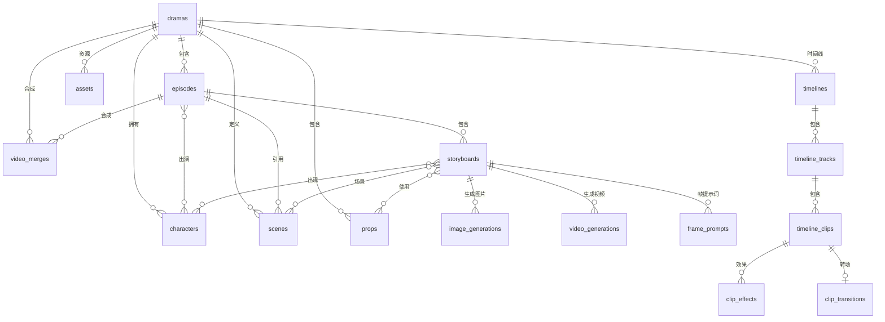

# 数据库表结构文档

> 项目：AI 短剧生成平台
> ORM：GORM
> 数据库：SQLite
> 更新时间：2026-02-25

---

## 目录

- [1. 核心业务表](#1-核心业务表)
- [2. AI 生成相关表](#2-ai-生成相关表)
- [3. 时间线编辑表](#3-时间线编辑表)
- [4. 资源管理表](#4-资源管理表)
- [5. 配置与任务表](#5-配置与任务表)
- [6. 多对多关联表](#6-多对多关联表)
- [7. 表关系总览](#7-表关系总览)
- [8. 表统计汇总](#8-表统计汇总)

---

## 1. 核心业务表

### 1.1 `dramas` - 剧本表

**文件路径**: `domain/models/drama.go`

| 字段名 | 类型 | 约束 | 说明 |
|--------|------|------|------|
| `id` | INTEGER | PRIMARY KEY, AUTO_INCREMENT | 主键 |
| `title` | VARCHAR(200) | NOT NULL | 剧本标题 |
| `description` | TEXT | - | 描述 |
| `genre` | VARCHAR(50) | - | 类型/流派 |
| `style` | VARCHAR(50) | DEFAULT 'realistic' | 风格 |
| `total_episodes` | INTEGER | DEFAULT 1 | 总集数 |
| `total_duration` | INTEGER | DEFAULT 0 | 总时长(秒) |
| `status` | VARCHAR(20) | DEFAULT 'draft' | 状态: draft/in_progress/completed |
| `thumbnail` | VARCHAR(500) | - | 缩略图 |
| `tags` | JSON | - | 标签 |
| `metadata` | JSON | - | 元数据 |
| `created_at` | DATETIME | NOT NULL | 创建时间 |
| `updated_at` | DATETIME | NOT NULL | 更新时间 |
| `deleted_at` | DATETIME | INDEX | 软删除时间 |

**关联关系**:
- 一对多 → `episodes` (章节)
- 一对多 → `characters` (角色)
- 一对多 → `scenes` (场景)
- 一对多 → `props` (道具)

---

### 1.2 `episodes` - 章节表

| 字段名 | 类型 | 约束 | 说明 |
|--------|------|------|------|
| `id` | INTEGER | PRIMARY KEY, AUTO_INCREMENT | 主键 |
| `drama_id` | INTEGER | NOT NULL, INDEX | 外键 → dramas |
| `episode_number` | INTEGER | NOT NULL | 集数序号 |
| `title` | VARCHAR(200) | NOT NULL | 章节标题 |
| `script_content` | LONGTEXT | - | 剧本内容 |
| `description` | TEXT | - | 描述 |
| `duration` | INTEGER | DEFAULT 0 | 时长(秒) |
| `status` | VARCHAR(20) | DEFAULT 'draft' | 状态 |
| `video_url` | VARCHAR(500) | - | 视频URL |
| `thumbnail` | VARCHAR(500) | - | 缩略图 |
| `created_at` | DATETIME | NOT NULL | 创建时间 |
| `updated_at` | DATETIME | NOT NULL | 更新时间 |
| `deleted_at` | DATETIME | INDEX | 软删除时间 |

**关联关系**:
- 多对一 → `dramas`
- 一对多 → `storyboards` (分镜)
- 多对多 → `characters` (通过 `episode_characters`)
- 一对多 → `scenes` (场景)

---

### 1.3 `characters` - 角色表

| 字段名 | 类型 | 约束 | 说明 |
|--------|------|------|------|
| `id` | INTEGER | PRIMARY KEY, AUTO_INCREMENT | 主键 |
| `drama_id` | INTEGER | NOT NULL, INDEX | 外键 → dramas |
| `name` | VARCHAR(100) | NOT NULL | 角色名称 |
| `role` | VARCHAR(50) | - | 角色类型 |
| `description` | TEXT | - | 描述 |
| `appearance` | TEXT | - | 外貌描述 |
| `personality` | TEXT | - | 性格描述 |
| `voice_style` | VARCHAR(200) | - | 声音风格 |
| `image_url` | VARCHAR(500) | - | 图片URL |
| `local_path` | TEXT | - | 本地存储路径 |
| `reference_images` | JSON | - | 参考图片 |
| `seed_value` | VARCHAR(100) | - | 种子值 |
| `sort_order` | INTEGER | DEFAULT 0 | 排序顺序 |
| `created_at` | DATETIME | NOT NULL | 创建时间 |
| `updated_at` | DATETIME | NOT NULL | 更新时间 |
| `deleted_at` | DATETIME | INDEX | 软删除时间 |

**关联关系**:
- 多对一 → `dramas`
- 多对多 → `episodes` (通过 `episode_characters`)
- 多对多 → `storyboards` (通过 `storyboard_characters`)

---

### 1.4 `scenes` - 场景表

| 字段名 | 类型 | 约束 | 说明 |
|--------|------|------|------|
| `id` | INTEGER | PRIMARY KEY, AUTO_INCREMENT | 主键 |
| `drama_id` | INTEGER | NOT NULL, INDEX | 外键 → dramas |
| `episode_id` | INTEGER | INDEX | 外键 → episodes (可选) |
| `location` | VARCHAR(200) | NOT NULL | 地点 |
| `time` | VARCHAR(100) | NOT NULL | 时间 |
| `prompt` | TEXT | NOT NULL | 提示词 |
| `storyboard_count` | INTEGER | DEFAULT 1 | 分镜数量 |
| `image_url` | VARCHAR(500) | - | 图片URL |
| `local_path` | TEXT | - | 本地存储路径 |
| `status` | VARCHAR(20) | DEFAULT 'pending' | 状态: pending/generated/failed |
| `created_at` | DATETIME | NOT NULL | 创建时间 |
| `updated_at` | DATETIME | NOT NULL | 更新时间 |
| `deleted_at` | DATETIME | INDEX | 软删除时间 |

**关联关系**:
- 多对一 → `dramas`
- 多对一 → `episodes` (可选)

---

### 1.5 `props` - 道具表

| 字段名 | 类型 | 约束 | 说明 |
|--------|------|------|------|
| `id` | INTEGER | PRIMARY KEY, AUTO_INCREMENT | 主键 |
| `drama_id` | INTEGER | NOT NULL, INDEX | 外键 → dramas |
| `name` | VARCHAR(100) | NOT NULL | 道具名称 |
| `type` | VARCHAR(50) | - | 类型(weapon/daily/vehicle等) |
| `description` | TEXT | - | 描述 |
| `prompt` | TEXT | - | AI图片提示词 |
| `image_url` | VARCHAR(500) | - | 图片URL |
| `local_path` | TEXT | - | 本地存储路径 |
| `reference_images` | JSON | - | 参考图片 |
| `created_at` | DATETIME | NOT NULL | 创建时间 |
| `updated_at` | DATETIME | NOT NULL | 更新时间 |
| `deleted_at` | DATETIME | INDEX | 软删除时间 |

**关联关系**:
- 多对一 → `dramas`
- 多对多 → `storyboards` (通过 `storyboard_props`)

---

### 1.6 `storyboards` - 分镜表

| 字段名 | 类型 | 约束 | 说明 |
|--------|------|------|------|
| `id` | INTEGER | PRIMARY KEY, AUTO_INCREMENT | 主键 |
| `episode_id` | INTEGER | NOT NULL, INDEX | 外键 → episodes |
| `scene_id` | INTEGER | INDEX | 外键 → scenes |
| `storyboard_number` | INTEGER | NOT NULL | 分镜序号 |
| `title` | VARCHAR(255) | - | 标题 |
| `location` | VARCHAR(255) | - | 地点 |
| `time` | VARCHAR(255) | - | 时间 |
| `shot_type` | VARCHAR(100) | - | 镜头类型 |
| `angle` | VARCHAR(100) | - | 角度 |
| `movement` | VARCHAR(100) | - | 运动 |
| `action` | TEXT | - | 动作描述 |
| `result` | TEXT | - | 结果 |
| `atmosphere` | TEXT | - | 氛围 |
| `image_prompt` | TEXT | - | 图片提示词 |
| `video_prompt` | TEXT | - | 视频提示词 |
| `bgm_prompt` | TEXT | - | 背景音乐提示词 |
| `sound_effect` | VARCHAR(255) | - | 音效 |
| `dialogue` | TEXT | - | 对话 |
| `description` | TEXT | - | 描述 |
| `duration` | INTEGER | DEFAULT 5 | 时长(秒) |
| `composed_image` | TEXT | - | 合成图片 |
| `video_url` | TEXT | - | 视频URL |
| `status` | VARCHAR(20) | DEFAULT 'pending' | 状态 |
| `created_at` | DATETIME | NOT NULL | 创建时间 |
| `updated_at` | DATETIME | NOT NULL | 更新时间 |
| `deleted_at` | DATETIME | INDEX | 软删除时间 |

**关联关系**:
- 多对一 → `episodes`
- 多对一 → `scenes` (可选)
- 多对多 → `characters` (通过 `storyboard_characters`)
- 多对多 → `props` (通过 `storyboard_props`)

---

## 2. AI 生成相关表

### 2.1 `image_generations` - 图片生成记录表

**文件路径**: `domain/models/image_generation.go`

| 字段名 | 类型 | 约束 | 说明 |
|--------|------|------|------|
| `id` | INTEGER | PRIMARY KEY | 主键 |
| `storyboard_id` | INTEGER | INDEX | 外键 → storyboards |
| `drama_id` | INTEGER | NOT NULL, INDEX | 外键 → dramas |
| `scene_id` | INTEGER | INDEX | 外键 → scenes |
| `character_id` | INTEGER | INDEX | 外键 → characters |
| `prop_id` | INTEGER | INDEX | 外键 → props |
| `image_type` | VARCHAR(20) | DEFAULT 'storyboard' | 图片类型 |
| `frame_type` | VARCHAR(20) | - | 帧类型 |
| `provider` | VARCHAR(50) | NOT NULL | 提供商 |
| `prompt` | TEXT | NOT NULL | 提示词 |
| `negative_prompt` | TEXT | - | 负面提示词 |
| `model` | VARCHAR(100) | - | 模型名称 |
| `size` | VARCHAR(20) | - | 尺寸 |
| `quality` | VARCHAR(20) | - | 质量 |
| `style` | VARCHAR(50) | - | 风格 |
| `steps` | INTEGER | - | 步数 |
| `cfg_scale` | REAL | - | CFG缩放 |
| `seed` | INTEGER | - | 种子值 |
| `image_url` | TEXT | - | 图片URL |
| `minio_url` | TEXT | - | MinIO URL |
| `local_path` | TEXT | - | 本地路径 |
| `status` | VARCHAR(20) | DEFAULT 'pending' | 状态 |
| `task_id` | VARCHAR(200) | - | 任务ID |
| `error_msg` | TEXT | - | 错误信息 |
| `width` | INTEGER | - | 宽度 |
| `height` | INTEGER | - | 高度 |
| `reference_images` | JSON | - | 参考图片 |
| `created_at` | DATETIME | - | 创建时间 |
| `updated_at` | DATETIME | - | 更新时间 |
| `completed_at` | DATETIME | - | 完成时间 |

---

### 2.2 `video_generations` - 视频生成记录表

**文件路径**: `domain/models/video_generation.go`

| 字段名 | 类型 | 约束 | 说明 |
|--------|------|------|------|
| `id` | INTEGER | PRIMARY KEY | 主键 |
| `storyboard_id` | INTEGER | INDEX | 外键 → storyboards |
| `drama_id` | INTEGER | NOT NULL, INDEX | 外键 → dramas |
| `provider` | VARCHAR(50) | NOT NULL, INDEX | 提供商 |
| `prompt` | TEXT | NOT NULL | 提示词 |
| `model` | VARCHAR(100) | - | 模型名称 |
| `image_gen_id` | INTEGER | INDEX | 外键 → image_generations |
| `reference_mode` | VARCHAR(20) | - | 参考图模式 |
| `image_url` | VARCHAR(1000) | - | 图片URL |
| `first_frame_url` | VARCHAR(1000) | - | 首帧URL |
| `last_frame_url` | VARCHAR(1000) | - | 尾帧URL |
| `reference_image_urls` | TEXT | - | 参考图片URLs(JSON) |
| `duration` | INTEGER | - | 时长 |
| `fps` | INTEGER | - | 帧率 |
| `resolution` | VARCHAR(50) | - | 分辨率 |
| `aspect_ratio` | VARCHAR(20) | - | 宽高比 |
| `style` | VARCHAR(100) | - | 风格 |
| `motion_level` | INTEGER | - | 运动级别 |
| `camera_motion` | VARCHAR(100) | - | 镜头运动 |
| `seed` | INTEGER | - | 种子值 |
| `video_url` | VARCHAR(1000) | - | 视频URL |
| `minio_url` | VARCHAR(1000) | - | MinIO URL |
| `local_path` | VARCHAR(500) | - | 本地路径 |
| `status` | VARCHAR(20) | DEFAULT 'pending', INDEX | 状态 |
| `task_id` | VARCHAR(200) | INDEX | 任务ID |
| `error_msg` | TEXT | - | 错误信息 |
| `completed_at` | DATETIME | - | 完成时间 |
| `width` | INTEGER | - | 宽度 |
| `height` | INTEGER | - | 高度 |
| `created_at` | DATETIME | - | 创建时间 |
| `updated_at` | DATETIME | - | 更新时间 |
| `deleted_at` | DATETIME | INDEX | 软删除时间 |

---

### 2.3 `video_merges` - 视频合成记录表

**文件路径**: `domain/models/video_merge.go`

| 字段名 | 类型 | 约束 | 说明 |
|--------|------|------|------|
| `id` | INTEGER | PRIMARY KEY, AUTO_INCREMENT | 主键 |
| `episode_id` | INTEGER | NOT NULL, INDEX | 外键 → episodes |
| `drama_id` | INTEGER | NOT NULL, INDEX | 外键 → dramas |
| `title` | VARCHAR(200) | - | 标题 |
| `provider` | VARCHAR(50) | NOT NULL | 提供商 |
| `model` | VARCHAR(100) | - | 模型名称 |
| `status` | VARCHAR(20) | DEFAULT 'pending' | 状态 |
| `scenes` | JSON | NOT NULL | 场景片段列表 |
| `merged_url` | VARCHAR(500) | - | 合成视频URL |
| `duration` | INTEGER | - | 总时长(秒) |
| `task_id` | VARCHAR(100) | - | 任务ID |
| `error_msg` | TEXT | - | 错误信息 |
| `created_at` | DATETIME | NOT NULL | 创建时间 |
| `completed_at` | DATETIME | - | 完成时间 |
| `deleted_at` | DATETIME | INDEX | 软删除时间 |

---

### 2.4 `frame_prompts` - 帧提示词表

**文件路径**: `domain/models/frame_prompt.go`

| 字段名 | 类型 | 约束 | 说明 |
|--------|------|------|------|
| `id` | INTEGER | PRIMARY KEY | 主键 |
| `storyboard_id` | INTEGER | NOT NULL, INDEX | 外键 → storyboards |
| `frame_type` | VARCHAR(20) | NOT NULL, INDEX | 帧类型: first/key/last/panel/action |
| `prompt` | TEXT | NOT NULL | 提示词 |
| `description` | TEXT | - | 描述 |
| `layout` | VARCHAR(50) | - | 布局 |

---

## 3. 时间线编辑表

**文件路径**: `domain/models/timeline.go`

### 3.1 `timelines` - 时间线表

| 字段名 | 类型 | 约束 | 说明 |
|--------|------|------|------|
| `id` | INTEGER | PRIMARY KEY | 主键 |
| `drama_id` | INTEGER | NOT NULL, INDEX | 外键 → dramas |
| `episode_id` | INTEGER | INDEX | 外键 → episodes |
| `name` | VARCHAR(200) | NOT NULL | 名称 |
| `description` | TEXT | - | 描述 |
| `duration` | INTEGER | DEFAULT 0 | 时长 |
| `fps` | INTEGER | DEFAULT 30 | 帧率 |
| `resolution` | VARCHAR(50) | - | 分辨率 |
| `status` | VARCHAR(20) | DEFAULT 'draft', INDEX | 状态 |

---

### 3.2 `timeline_tracks` - 时间线轨道表

| 字段名 | 类型 | 约束 | 说明 |
|--------|------|------|------|
| `id` | INTEGER | PRIMARY KEY | 主键 |
| `timeline_id` | INTEGER | NOT NULL, INDEX | 外键 → timelines |
| `name` | VARCHAR(100) | NOT NULL | 名称 |
| `type` | VARCHAR(20) | NOT NULL | 类型: video/audio/text |
| `order` | INTEGER | DEFAULT 0 | 排序 |
| `is_locked` | BOOLEAN | DEFAULT false | 是否锁定 |
| `is_muted` | BOOLEAN | DEFAULT false | 是否静音 |
| `volume` | INTEGER | DEFAULT 100 | 音量 |

---

### 3.3 `timeline_clips` - 时间线片段表

| 字段名 | 类型 | 约束 | 说明 |
|--------|------|------|------|
| `id` | INTEGER | PRIMARY KEY | 主键 |
| `track_id` | INTEGER | NOT NULL, INDEX | 外键 → timeline_tracks |
| `asset_id` | INTEGER | INDEX | 外键 → assets |
| `storyboard_id` | INTEGER | INDEX | 外键 → storyboards |
| `name` | VARCHAR(200) | - | 名称 |
| `start_time` | INTEGER | NOT NULL | 开始时间(毫秒) |
| `end_time` | INTEGER | NOT NULL | 结束时间(毫秒) |
| `duration` | INTEGER | NOT NULL | 时长(毫秒) |
| `trim_start` | INTEGER | - | 裁剪开始 |
| `trim_end` | INTEGER | - | 裁剪结束 |
| `speed` | REAL | DEFAULT 1.0 | 速度 |
| `volume` | INTEGER | - | 音量 |
| `is_muted` | BOOLEAN | DEFAULT false | 是否静音 |
| `fade_in` | INTEGER | - | 淡入时长(毫秒) |
| `fade_out` | INTEGER | - | 淡出时长(毫秒) |
| `transition_in_id` | INTEGER | INDEX | 外键 → clip_transitions |
| `transition_out_id` | INTEGER | INDEX | 外键 → clip_transitions |

---

### 3.4 `clip_transitions` - 片段转场表

| 字段名 | 类型 | 约束 | 说明 |
|--------|------|------|------|
| `id` | INTEGER | PRIMARY KEY | 主键 |
| `type` | VARCHAR(50) | NOT NULL | 类型: fade/crossfade/slide/wipe/zoom/dissolve |
| `duration` | INTEGER | DEFAULT 500 | 时长(毫秒) |
| `easing` | VARCHAR(50) | - | 缓动函数 |
| `config` | JSON | - | 配置 |

---

### 3.5 `clip_effects` - 片段效果表

| 字段名 | 类型 | 约束 | 说明 |
|--------|------|------|------|
| `id` | INTEGER | PRIMARY KEY | 主键 |
| `clip_id` | INTEGER | NOT NULL, INDEX | 外键 → timeline_clips |
| `type` | VARCHAR(50) | NOT NULL | 类型: filter/color/blur/brightness/contrast/saturation |
| `name` | VARCHAR(100) | - | 名称 |
| `is_enabled` | BOOLEAN | DEFAULT true | 是否启用 |
| `order` | INTEGER | DEFAULT 0 | 排序 |
| `config` | JSON | - | 配置 |

---

## 4. 资源管理表

### 4.1 `assets` - 资源表

**文件路径**: `domain/models/asset.go`

| 字段名 | 类型 | 约束 | 说明 |
|--------|------|------|------|
| `id` | INTEGER | PRIMARY KEY | 主键 |
| `drama_id` | INTEGER | INDEX | 外键 → dramas |
| `episode_id` | INTEGER | INDEX | 外键 → episodes |
| `storyboard_id` | INTEGER | INDEX | 外键 → storyboards |
| `storyboard_num` | INTEGER | - | 分镜序号 |
| `name` | VARCHAR(200) | NOT NULL | 名称 |
| `description` | TEXT | - | 描述 |
| `type` | VARCHAR(20) | NOT NULL, INDEX | 类型: image/video/audio |
| `category` | VARCHAR(50) | INDEX | 分类 |
| `url` | VARCHAR(1000) | NOT NULL | URL |
| `thumbnail_url` | VARCHAR(1000) | - | 缩略图URL |
| `local_path` | VARCHAR(500) | - | 本地路径 |
| `file_size` | INTEGER | - | 文件大小 |
| `mime_type` | VARCHAR(100) | - | MIME类型 |
| `width` | INTEGER | - | 宽度 |
| `height` | INTEGER | - | 高度 |
| `duration` | INTEGER | - | 时长 |
| `format` | VARCHAR(50) | - | 格式 |
| `image_gen_id` | INTEGER | INDEX | 外键 → image_generations |
| `video_gen_id` | INTEGER | INDEX | 外键 → video_generations |
| `is_favorite` | BOOLEAN | DEFAULT false | 是否收藏 |
| `view_count` | INTEGER | DEFAULT 0 | 浏览次数 |

---

### 4.2 `asset_tags` - 资源标签表

| 字段名 | 类型 | 约束 | 说明 |
|--------|------|------|------|
| `id` | INTEGER | PRIMARY KEY | 主键 |
| `name` | TEXT | NOT NULL | 标签名称 |
| `color` | TEXT | - | 颜色 |

---

### 4.3 `asset_collections` - 资源集合表

| 字段名 | 类型 | 约束 | 说明 |
|--------|------|------|------|
| `id` | INTEGER | PRIMARY KEY | 主键 |
| `drama_id` | INTEGER | INDEX | 外键 → dramas |
| `name` | TEXT | NOT NULL | 集合名称 |
| `description` | TEXT | - | 描述 |

---

### 4.4 `asset_tag_relations` - 资源标签关系表

| 字段名 | 类型 | 约束 | 说明 |
|--------|------|------|------|
| `asset_id` | INTEGER | NOT NULL | 外键 → assets |
| `asset_tag_id` | INTEGER | NOT NULL | 外键 → asset_tags |

---

### 4.5 `asset_collection_relations` - 资源集合关系表

| 字段名 | 类型 | 约束 | 说明 |
|--------|------|------|------|
| `asset_id` | INTEGER | NOT NULL | 外键 → assets |
| `asset_collection_id` | INTEGER | NOT NULL | 外键 → asset_collections |

---

## 5. 配置与任务表

### 5.1 `ai_service_configs` - AI服务配置表

**文件路径**: `domain/models/ai_config.go`

| 字段名 | 类型 | 约束 | 说明 |
|--------|------|------|------|
| `id` | INTEGER | PRIMARY KEY, AUTO_INCREMENT | 主键 |
| `service_type` | VARCHAR(50) | NOT NULL | 服务类型: text/image/video |
| `provider` | VARCHAR(50) | - | 提供商: openai/gemini/volcengine等 |
| `name` | VARCHAR(100) | NOT NULL | 配置名称 |
| `base_url` | VARCHAR(255) | NOT NULL | 基础URL |
| `api_key` | VARCHAR(255) | NOT NULL | API密钥 |
| `model` | TEXT | - | 模型名称(支持数组) |
| `endpoint` | VARCHAR(255) | - | 端点 |
| `query_endpoint` | VARCHAR(255) | - | 查询端点 |
| `priority` | INTEGER | DEFAULT 0 | 优先级 |
| `is_default` | BOOLEAN | DEFAULT false | 是否默认 |
| `is_active` | BOOLEAN | DEFAULT true | 是否激活 |
| `settings` | TEXT | - | 设置(JSON) |

---

### 5.2 `ai_service_providers` - AI服务提供商表

| 字段名 | 类型 | 约束 | 说明 |
|--------|------|------|------|
| `id` | INTEGER | PRIMARY KEY, AUTO_INCREMENT | 主键 |
| `name` | VARCHAR(100) | NOT NULL, UNIQUE | 提供商标识 |
| `display_name` | VARCHAR(100) | NOT NULL | 显示名称 |
| `service_type` | VARCHAR(50) | NOT NULL | 服务类型 |
| `default_url` | VARCHAR(255) | - | 默认URL |
| `description` | TEXT | - | 描述 |
| `is_active` | BOOLEAN | DEFAULT true | 是否激活 |

---

### 5.3 `async_tasks` - 异步任务表

**文件路径**: `domain/models/task.go`

| 字段名 | 类型 | 约束 | 说明 |
|--------|------|------|------|
| `id` | VARCHAR(36) | PRIMARY KEY | 主键(UUID) |
| `type` | VARCHAR(50) | NOT NULL, INDEX | 任务类型 |
| `status` | VARCHAR(20) | NOT NULL, INDEX | 状态: pending/processing/completed/failed |
| `progress` | INTEGER | DEFAULT 0 | 进度(0-100) |
| `message` | VARCHAR(500) | - | 状态消息 |
| `error` | TEXT | - | 错误信息 |
| `result` | TEXT | - | 结果数据(JSON) |
| `resource_id` | VARCHAR(36) | INDEX | 关联资源ID |
| `created_at` | DATETIME | - | 创建时间 |
| `updated_at` | DATETIME | - | 更新时间 |
| `completed_at` | DATETIME | - | 完成时间 |
| `deleted_at` | DATETIME | INDEX | 软删除时间 |

---

### 5.4 `character_libraries` - 角色库表

**文件路径**: `domain/models/character_library.go`

| 字段名 | 类型 | 约束 | 说明 |
|--------|------|------|------|
| `id` | INTEGER | PRIMARY KEY, AUTO_INCREMENT | 主键 |
| `name` | VARCHAR(100) | NOT NULL | 角色名称 |
| `category` | VARCHAR(50) | - | 分类 |
| `image_url` | VARCHAR(500) | NOT NULL | 图片URL |
| `local_path` | VARCHAR(500) | - | 本地路径 |
| `description` | TEXT | - | 描述 |
| `tags` | VARCHAR(500) | - | 标签 |
| `source_type` | VARCHAR(20) | DEFAULT 'generated' | 来源类型: generated/uploaded |

---

## 6. 多对多关联表

由 GORM 自动管理的关联表：

| 表名 | 关联 | 说明 |
|------|------|------|
| `episode_characters` | episodes ↔ characters | 章节与角色的多对多关系 |
| `storyboard_characters` | storyboards ↔ characters | 分镜与角色的多对多关系 |
| `storyboard_props` | storyboards ↔ props | 分镜与道具的多对多关系 |

---

## 7. 表关系总览

### ER 图 - 核心业务表



### 层级结构图

```
dramas (剧本)
├── 1:N → episodes (章节)
│   ├── 1:N → storyboards (分镜)
│   │   ├── 1:N → image_generations (图片生成)
│   │   ├── 1:N → video_generations (视频生成)
│   │   └── 1:N → frame_prompts (帧提示词)
│   ├── M:N → characters (通过 episode_characters)
│   └── 1:N → video_merges (视频合成)
├── 1:N → characters (角色)
├── 1:N → scenes (场景)
├── 1:N → props (道具)
└── 1:N → timelines (时间线)
    └── 1:N → timeline_tracks (轨道)
        └── 1:N → timeline_clips (片段)
            └── 1:N → clip_effects (效果)

全局配置:
├── ai_service_configs (AI服务配置)
├── ai_service_providers (AI服务提供商)
└── character_libraries (角色库)
```

---

## 8. 表统计汇总

| 分类 | 表数量 | 主要表 |
|------|--------|--------|
| **核心业务** | 6 | dramas, episodes, characters, scenes, props, storyboards |
| **AI生成** | 4 | image_generations, video_generations, video_merges, frame_prompts |
| **时间线编辑** | 5 | timelines, timeline_tracks, timeline_clips, clip_effects, clip_transitions |
| **资源管理** | 5 | assets, asset_tags, asset_collections, asset_tag_relations, asset_collection_relations |
| **配置任务** | 4 | ai_service_configs, ai_service_providers, async_tasks, character_libraries |
| **关联表** | 3 | episode_characters, storyboard_characters, storyboard_props |
| **总计** | **27** | |

---

## 9. 迁移文件

| 文件路径 | 说明 |
|---------|------|
| `migrations/init.sql` | 初始化脚本，创建所有表 |
| `migrations/20260126_add_local_path.sql` | 为多个表添加 `local_path` 字段 |

---

## 10. 模型文件索引

| 文件路径 | 包含模型 |
|---------|----------|
| `domain/models/drama.go` | Drama |
| `domain/models/episode.go` | Episode |
| `domain/models/character.go` | Character |
| `domain/models/scene.go` | Scene |
| `domain/models/prop.go` | Prop |
| `domain/models/storyboard.go` | Storyboard |
| `domain/models/image_generation.go` | ImageGeneration |
| `domain/models/video_generation.go` | VideoGeneration |
| `domain/models/video_merge.go` | VideoMerge |
| `domain/models/frame_prompt.go` | FramePrompt |
| `domain/models/timeline.go` | Timeline, TimelineTrack, TimelineClip, ClipTransition, ClipEffect |
| `domain/models/asset.go` | Asset, AssetTag, AssetCollection, AssetTagRelation, AssetCollectionRelation |
| `domain/models/ai_config.go` | AIServiceConfig, AIServiceProvider |
| `domain/models/task.go` | AsyncTask |
| `domain/models/character_library.go` | CharacterLibrary |
