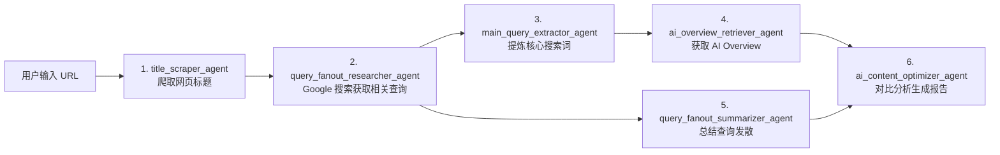

# GEO Agent 设计文档

> **GEO** (Generative Engine Optimization，生成式引擎优化) —— SEO 的 AI 时代进化版
>
> 基于 Eino 框架构建的智能体，用于优化内容在生成式搜索引擎（ChatGPT、Perplexity、Google AI Overviews）中的引用和推荐率。

---

## 背景与动机

### 从 SEO 到 GEO

| 维度 | SEO (传统) | GEO (AI 时代) |
|------|-----------|--------------|
| **目标** | 搜索结果排名更高 | 被 AI 引用/推荐 |
| **优化对象** | 关键词、链接、页面结构 | 内容质量、权威性、AI 可读性 |
| **核心策略** | 技术优化、外链建设 | 知识图谱、结构化数据、E-E-A-T |
| **搜索结果** | 10 个蓝色链接 | AI 生成摘要 + 引用来源 |
| **用户行为** | 点击链接进入网站 | 直接获取答案（零点击） |

### 生成式搜索引擎的影响

- **ChatGPT Search**：OpenAI 的搜索功能
- **Perplexity**：AI 原生搜索引擎
- **Google AI Overviews**：Google 的 AI 摘要
- **Bing Copilot**：微软的 AI 助手

**关键变化**：用户不再点击链接，而是直接获取 AI 生成的答案。因此，优化目标从「点击率」转变为「引用率」。

---

## GEO Agent 架构设计

### 系统架构图

```
┌─────────────────────────────────────────────────────────────────┐
│                     GEO Agent (基于 Eino ADK)                    │
├─────────────────────────────────────────────────────────────────┤
│                                                                  │
│  ┌──────────────────────────────────────────────────────────┐  │
│  │  内容分析与优化模块                                       │  │
│  │  - AI 引用潜力评分                                        │  │
│  │  - 内容结构优化建议                                        │  │
│  │  - E-E-A-T 评估                                           │  │
│  │  - Schema.org 标记生成                                    │  │
│  └──────────────────────────────────────────────────────────┘  │
│                           ↓                                      │
│  ┌──────────────────────────────────────────────────────────┐  │
│  │  多平台监控模块                                           │  │
│  │  - ChatGPT 引用追踪                                       │  │
│  │  - Perplexity 分析                                         │  │
│  │  - Google AI Overviews 监控                                │  │
│  │  - 品牌提及监测                                           │  │
│  └──────────────────────────────────────────────────────────┘  │
│                           ↓                                      │
│  ┌──────────────────────────────────────────────────────────┐  │
│  │  知识图谱构建模块                                         │  │
│  │  - 实体抽取与关系建立                                      │  │
│  │  - 结构化数据生成 (JSON-LD)                               │  │
│  │  - 语义关联优化                                           │  │
│  └──────────────────────────────────────────────────────────┘  │
│                           ↓                                      │
│  ┌──────────────────────────────────────────────────────────┐  │
│  │  竞争对手分析模块                                         │  │
│  │  - 竞品内容 AI 引用分析                                    │  │
│  │  - 差距识别与机会发现                                      │  │
│  │  - 优化建议生成                                           │  │
│  └──────────────────────────────────────────────────────────┘  │
│                                                                  │
├─────────────────────────────────────────────────────────────────┤
│                     Eino Agent Development Kit                   │
│                                                                   │
│  ┌──────────────┐  ┌──────────────┐  ┌──────────────────────┐  │
│  │   Chain      │  │    Tools     │  │      Memory          │  │
│  │   编排       │  │   (能力)     │  │    (知识库/历史)      │  │
│  └──────────────┘  └──────────────┘  └──────────────────────┘  │
│                                                                   │
│  ┌──────────────┐  ┌──────────────┐  ┌──────────────────────┐  │
│  │   LLM        │  │   Retriever  │  │     Callback         │  │
│  │  (豆包/GPT)  │  │   (RAG)      │  │    (工具调用)         │  │
│  └──────────────┘  └──────────────┘  └──────────────────────┘  │
└─────────────────────────────────────────────────────────────────┘
```

---

## 核心功能模块

### 1. 内容分析与优化

**功能**：分析现有内容，生成 GEO 优化建议

**输入**：
- 内容 URL 或文本
- 目标关键词/主题
- 目标 AI 引擎（可选）

**输出**：
```json
{
  "geo_score": 75,
  "citation_potential": "high",
  "suggestions": [
    {
      "category": "structure",
      "issue": "缺少明确的观点陈述",
      "suggestion": "在首段增加明确的专家观点和结论",
      "priority": "high"
    },
    {
      "category": "authority",
      "issue": "缺少作者信息",
      "suggestion": "添加作者简介和资质信息",
      "priority": "medium"
    }
  ],
  "schema_data": {
    "@type": "Article",
    "headline": "...",
    "author": {...},
    "datePublished": "..."
  }
}
```

**实现要点**：
- 使用 Eino 的 `ChatTemplate` 构建分析提示词
- 使用 `Tool` 调用内容解析和评分逻辑
- 使用 `Chain` 编排多步骤分析流程

### 2. 多平台监控

**功能**：监控品牌/内容在各 AI 引擎的引用情况

**监控平台**：
- ChatGPT Search
- Perplexity
- Google AI Overviews
- Bing Copilot

**数据采集**：
```go
type CitationMonitor struct {
    // 定期查询 AI 引擎
    QueryAIEngine(query string) (*CitationResult, error)

    // 分析引用来源
    AnalyzeCitations(content string) ([]Citation, error)

    // 生成趋势报告
    GenerateTrendReport(timeRange string) (*TrendReport, error)
}
```

**实现要点**：
- 使用 Eino 的 `Parallel` Chain 并行查询多个平台
- 使用 `Memory` 存储历史数据，生成趋势分析
- 使用 `Callback` 实现定时监控任务

### 3. 知识图谱构建

**功能**：从内容中抽取实体和关系，构建结构化数据

**工作流程**：
```
原始内容 → 实体抽取 → 关系建立 → JSON-LD 生成 → 部署到网站
```

**实体类型**：
- 人物（作者、专家）
- 组织（公司、机构）
- 概念（专业术语）
- 事件（新闻、案例）

**Schema.org 支持**：
- Article
- Organization
- Person
- FAQPage
- HowTo

### 4. 竞争对手分析

**功能**：分析竞品内容的 AI 引用表现，发现优化机会

**分析维度**：
- 内容长度和结构
- 引用来源多样性
- 专家引用情况
- 发布时间与时效性
- 内容原创性

**输出示例**：
```json
{
  "competitor": "example.com",
  "avg_citation_rate": 0.65,
  "top_performing_content": [
    {
      "url": "...",
      "citation_count": 120,
      "success_factors": [
        "明确的专家观点",
        "数据可视化",
        "及时的更新"
      ]
    }
  ],
  "gap_analysis": {
    "your_citation_rate": 0.32,
    "gap_reasons": [
      "缺少作者信息",
      "内容时效性不足",
      "缺少数据支撑"
    ]
  }
}
```

---

## 技术栈

### 核心框架

| 组件 | 选型 | 说明 |
|------|------|------|
| **Agent 框架** | [Eino](https://github.com/cloudwego/eino) | 字节开源的 Go AI Agent 开发框架 |
| **Web 框架** | Gin | API 服务 |
| **ORM** | GORM | 数据持久化 |
| **数据库** | PostgreSQL + PostGIS | 存储监控数据和空间数据 |
| **缓存** | Redis | 缓存查询结果 |
| **消息队列** | - | 异步任务处理（可选） |

### 依赖集成

```go
import (
    "github.com/cloudwego/eino/components/model"
    "github.com/cloudwego/eino/components/tool"
    "github.com/cloudwego/eino/flow/agent"
)
```

---

## 数据模型设计

### 内容分析记录

```go
type ContentAnalysis struct {
    BaseModel
    URL         string  `json:"url" gorm:"type:varchar(512);index"`
    ContentHash string  `json:"content_hash" gorm:"type:varchar(64);index"`
    GEOScore    float64 `json:"geo_score" gorm:"type:decimal(5,2)"`
    Suggestions JSON    `json:"suggestions" gorm:"type:jsonb"`
    AnalyzedAt  time.Time `json:"analyzed_at"`
}
```

### 引用监控记录

```go
type CitationRecord struct {
    BaseModel
    ContentID   uint      `json:"content_id" gorm:"index"`
    Platform    string    `json:"platform" gorm:"type:varchar(32);index"`
    Query       string    `json:"query" gorm:"type:varchar(512)"`
    IsCited     bool      `json:"is_cited"`
    CitationPos int       `json:"citation_pos"`
    Snippet     string    `json:"snippet" gorm:"type:text"`
    RecordedAt  time.Time `json:"recorded_at" gorm:"index"`
}
```

### 知识图谱实体

```go
type KnowledgeEntity struct {
    BaseModel
    Name      string    `json:"name" gorm:"type:varchar(256);index"`
    Type      string    `json:"type" gorm:"type:varchar(64);index"`
    Data      JSON      `json:"data" gorm:"type:jsonb"`
    SourceURL string    `json:"source_url" gorm:"type:varchar(512)"`
}
```

---

## API 设计

### 内容分析 API

```http
POST /api/v1/geo/analyze
Content-Type: application/json

{
  "url": "https://example.com/article",
  "content": "...",
  "target_engines": ["chatgpt", "perplexity"]
}

Response:
{
  "success": true,
  "data": {
    "geo_score": 75,
    "citation_potential": "high",
    "suggestions": [...],
    "schema_data": {...}
  }
}
```

### 引用监控 API

```http
GET /api/v1/geo/citations?platform=chatgpt&days=7

Response:
{
  "success": true,
  "data": {
    "total_citations": 145,
    "trend": "+12%",
    "by_platform": {...},
    "top_content": [...]
  }
}
```

### 知识图谱 API

```http
POST /api/v1/geo/knowledge/extract
Content-Type: application/json

{
  "content": "..."
}

Response:
{
  "success": true,
  "data": {
    "entities": [...],
    "relations": [...],
    "json_ld": "..."
  }
}
```

---

## 实现路线图

### Phase 1: 基础框架
- [ ] 集成 Eino 框架
- [ ] 实现基础内容分析
- [ ] 构建核心数据模型
- [ ] 搭建 API 服务

### Phase 2: 核心功能
- [ ] 多平台监控
- [ ] 知识图谱构建
- [ ] Schema.org 生成
- [ ] 优化建议引擎

### Phase 3: 高级特性
- [ ] 竞争对手分析
- [ ] 趋势预测
- [ ] A/B 测试框架
- [ ] 自动化优化

### Phase 4: 企业级功能
- [ ] 多租户支持
- [ ] 权限管理
- [ ] 报表系统
- [ ] Webhook 通知

---

## 从 CrewAI 到 Eino 的迁移方案

### 现有架构分析

**当前项目**：`geo-ai-agent` (Python + CrewAI)

**工作流程**：



**关键特点**：
- ✅ **顺序执行**：每个任务依赖前一个任务的输出
- ✅ **固定流程**：不需要动态调整计划
- ✅ **明确分工**：每个 Agent 有清晰的职责
- ✅ **无循环**：一次运行，线性完成

### ADK 模式选择

#### Eino ADK 可用模式对比

| 模式 | 适用场景 | 复杂度 | GEO 匹配度 |
|------|---------|--------|-----------|
| **Sequential** | 有明确先后顺序的多步骤任务 | ⭐ | ✅ 100% |
| **Parallel** | 可同时执行的独立任务 | ⭐ | ❌ 不适用 |
| **Loop** | 需要迭代直到满足条件 | ⭐⭐ | ❌ 不适用 |
| **Plan-Execute-Replan** | 需要动态调整计划的复杂任务 | ⭐⭐⭐ | ❌ 过度设计 |
| **Supervisor** | 层级化多 Agent 协调系统 | ⭐⭐⭐ | ⚠️ 可选 |

#### ✅ 推荐：Sequential 模式

**选择理由**：

1. **完美匹配**：现有 GEO 流程就是顺序执行
2. **简单高效**：代码量少，性能最优，无额外协调开销
3. **易于维护**：团队容易理解和扩展
4. **支持并行分支**：Sequential 可以处理 Node 4 和 Node 5 的并行依赖

#### ⚠️ 备选：Supervisor 模式

**适用场景**：
- 未来需要扩展为更复杂的系统
- 需要动态路由（根据内容类型选择不同分析流程）
- 需要支持多个内容来源（网页、PDF、视频等）

### 具体实现方案

#### 方案 A：Sequential 模式（推荐）

**目录结构**：

```
internal/agent/geo/
├── agents.go          # 6 个专业 Agent 定义
├── tools.go           # Bright Data 工具集成
├── chain.go           # Sequential Chain 构建
├── types.go           # 数据结构定义
└── examples/
    └── sequential/    # 参考 eino-examples
```

**核心代码示例**：

```go
package geo

import (
    "context"
    "github.com/cloudwego/eino/components/tool"
    "github.com/cloudwego/eino/flow/sequential"
)

// 1. 定义 6 个专业 Agent
type TitleScraperAgent struct {
    webTool *BrightDataWebUnlockerTool
}

func (a *TitleScraperAgent) Run(ctx context.Context, url string) (string, error) {
    // 爬取网页标题
    return a.webTool.Scrape(ctx, url)
}

type QueryFanoutResearcherAgent struct {
    searchTool *GoogleSearchTool
}

func (a *QueryFanoutResearcherAgent) Run(ctx context.Context, title string) ([]string, error) {
    // 使用 Google Search 工具获取相关查询
    return a.searchTool.Search(ctx, title)
}

// ... 其他 4 个 Agent 定义

// 2. 构建 Sequential Chain
func BuildGEOChain() (*sequential.Chain, error) {
    agents := NewGEOAgents() // 初始化所有 Agent

    return sequential.NewChain(
        context.Background(),
        []sequential.Node{
            {
                Agent: agents.TitleScraper,
                Name:  "title_scraper",
            },
            {
                Agent: agents.QueryFanoutResearcher,
                Name:  "query_fanout_researcher",
                DependsOn: []string{"title_scraper"},
            },
            {
                Agent: agents.MainQueryExtractor,
                Name:  "main_query_extractor",
                DependsOn: []string{"query_fanout_researcher"},
            },
            {
                Agent: agents.AIOverviewRetriever,
                Name:  "ai_overview_retriever",
                DependsOn: []string{"main_query_extractor"},
            },
            {
                Agent: agents.QueryFanoutSummarizer,
                Name:  "query_fanout_summarizer",
                DependsOn: []string{"query_fanout_researcher"}, // 并行分支
            },
            {
                Agent: agents.AIContentOptimizer,
                Name:  "ai_content_optimizer",
                DependsOn: []string{"ai_overview_retriever", "query_fanout_summarizer"},
            },
        },
    )
}

// 3. 执行
func (s *Service) AnalyzeURL(ctx context.Context, url string) (*Report, error) {
    chain, _ := BuildGEOChain()
    result, err := chain.Execute(ctx, map[string]any{
        "url": url,
    })

    if err != nil {
        return nil, err
    }

    return result["ai_content_optimizer"].(*Report), nil
}
```

**优势**：
- ✅ 代码简洁，易于理解
- ✅ 完美复制现有工作流程
- ✅ 性能最优（无额外协调开销）

#### 方案 B：Supervisor 模式（扩展性强）

**架构设计**：

```go
package geo

import (
    "context"
    "github.com/cloudwego/eino/flow/multiagent/supervisor"
)

// 1. 定义 GEO Supervisor
type GEOSupervisor struct {
    agents []agent.Agent
}

func (s *GEOSupervisor) Route(ctx context.Context, msg string) (string, error) {
    // 根据当前阶段路由到对应的子 Agent
    // Phase 1: 数据采集 → ScrapingAgent
    // Phase 2: 分析处理 → AnalysisAgent
    // Phase 3: 优化生成 → OptimizationAgent
}

// 2. 定义专业子 Agent
type ScrapingAgent struct {
    titleScraper    *TitleScraperAgent
    queryResearcher *QueryFanoutResearcherAgent
}

type AnalysisAgent struct {
    queryExtractor    *MainQueryExtractorAgent
    overviewRetriever *AIOverviewRetrieverAgent
    summarizer        *QueryFanoutSummarizerAgent
}

type OptimizationAgent struct {
    optimizer *AIContentOptimizerAgent
}

// 3. 构建 Supervisor Chain
func BuildGEOSupervisor() (*supervisor.SupervisorAgent, error) {
    return supervisor.NewSupervisor(
        context.Background(),
        &supervisor.Config{
            SupervisorAgent: &GEOSupervisor{
                Name:        "geo_supervisor",
                Description: "协调 GEO 内容优化的所有步骤",
                LLM:         llm,
            },
            SubAgents: []agent.Agent{
                &ScrapingAgent{...},
                &AnalysisAgent{...},
                &OptimizationAgent{...},
            },
        },
    )
}
```

**优势**：
- ✅ 更灵活的协调机制
- ✅ 易于扩展新功能
- ✅ 支持更复杂的决策逻辑

### 迁移步骤

#### Phase 1: 基础迁移（Sequential）

```bash
# 1. 在 peanut 项目中创建新目录
mkdir -p internal/agent/geo

# 2. 创建核心文件
touch internal/agent/geo/agents.go      # 6 个 Agent 定义
touch internal/agent/geo/tools.go       # Bright Data 工具集成
touch internal/agent/geo/chain.go       # Sequential Chain
touch internal/agent/geo/types.go       # 数据结构

# 3. 参考 Eino 示例
cp -r aaa/eino-examples/adk/intro/workflow/sequential internal/agent/geo/examples/
```

#### Phase 2: 工具集成

```go
// internal/agent/geo/tools/bright_data.go
package tools

import (
    "context"
    "encoding/json"
    "fmt"
    "io"
    "net/http"
)

type BrightDataSERPTool struct {
    apiKey string
    zone   string
    client *http.Client
}

type AIOverview struct {
    Summary  string   `json:"summary"`
    Sources  []string `json:"sources"`
    Snippet  string   `json:"snippet"`
}

func (t *BrightDataSERPTool) Search(ctx context.Context, query string) (*AIOverview, error) {
    req, _ := http.NewRequestWithContext(ctx, "GET",
        fmt.Sprintf("https://api.brightdata.com/serp?q=%s", query), nil)

    req.Header.Set("Authorization", "Bearer "+t.apiKey)

    resp, err := t.client.Do(req)
    if err != nil {
        return nil, err
    }
    defer resp.Body.Close()

    body, _ := io.ReadAll(resp.Body)

    var result AIOverview
    json.Unmarshal(body, &result)

    return &result, nil
}
```

#### Phase 3: API 暴露

```go
// internal/handler/geo.go
package handler

import (
    "github.com/gin-gonic/gin"
    "your-project/internal/agent/geo"
)

type Handler struct {
    geoService *geo.Service
}

func (h *Handler) AnalyzeContent(c *gin.Context) {
    var req struct {
        URL string `json:"url" binding:"required,url"`
    }

    if err := c.ShouldBindJSON(&req); err != nil {
        c.JSON(400, gin.H{"error": err.Error()})
        return
    }

    // 执行 GEO Chain
    report, err := h.geoService.AnalyzeURL(c.Request.Context(), req.URL)
    if err != nil {
        c.JSON(500, gin.H{"error": err.Error()})
        return
    }

    c.JSON(200, gin.H{
        "success": true,
        "data":    report,
    })
}
```

#### Phase 4: 注册路由

```go
// cmd/server/main.go
func setupRoutes(r *gin.Engine, h *handler.Handler) {
    // GEO 分析路由
    geoGroup := r.Group("/api/v1/geo")
    {
        geoGroup.POST("/analyze", h.AnalyzeContent)
        geoGroup.GET("/citations", h.GetCitations)
        geoGroup.POST("/knowledge/extract", h.ExtractKnowledge)
    }
}
```

### 迁移对照表

| CrewAI 组件 | Eino 对应 | 说明 |
|------------|----------|------|
| `Agent` | `agent.Agent` | 智能体接口 |
| `Task` | `sequential.Node` | 任务节点 |
| `Process.sequential` | `sequential.Chain` | 顺序执行链 |
| `Tool` | `tool.Tool` | 工具接口 |
| `LLM` | `components.model.ChatModel` | 聊天模型 |
| `Crew` | `sequential.Chain` | 完整流程 |

### 参考示例位置

```
aaa/eino-examples/
├── adk/
│   ├── intro/
│   │   └── workflow/
│   │       └── sequential/          ← Sequential 模式参考
│   └── human-in-the-loop/
│       ├── 5_supervisor/            ← Supervisor 模式参考
│       └── 6_plan-execute-replan/   ← Plan-Execute-Replan 模式参考
└── flow/agent/
    └── react/                       ← Agent 实现参考
```

---

## 参考资源

### 框架文档
- [Eino 官方文档](https://cloudwego.io/zh/docs/eino/overview/)
- [Eino GitHub](https://github.com/cloudwego/eino)
- [Eino 示例集合](https://github.com/cloudwego/eino-examples)

### GEO 相关资源
- [GEO (Generative Engine Optimization) 介绍](https://www.searchenginejournal.com/generative-engine-optimization/)
- [Perplexity 官方博客](https://blog.perplexity.ai/)
- [Google AI Overviews 指南](https://developers.google.com/search/docs/appearance/ai-overview)

### Schema.org
- [Schema.org 官方文档](https://schema.org/)
- [JSON-LD 结构化数据](https://json-ld.org/)

---

## 许可证

本文档遵循项目许可证。
